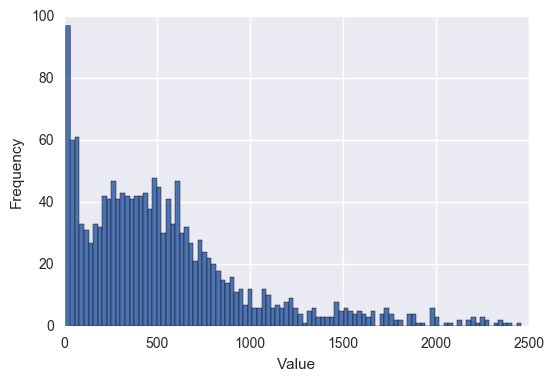
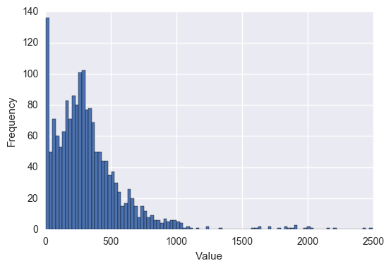
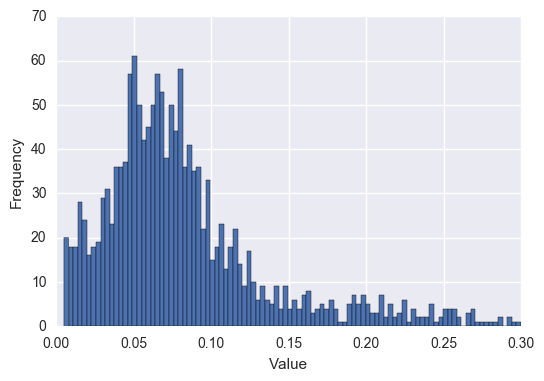

## Summary

In this post, I explore creating a choropleth map using census and crime report data from Portland, Oregon. The ultimate goal is finding a way to meaningfully compare these geographic blocks (census tracts). I will cover everything necessary to set up the data needed for these comparisions.  In my next post, I will discuss what kind of comparisons we can draw from this data and their validity.  Throughout this post, I will assume readers have a basic understanding of GIS concepts and data formats.

If you would like to skip ahead to the interactive map I have already created from this data, **[click here](https://crimestats.travishathaway.com/#map)**.

## Data Sources
The data I gathered to create this map came from the following sources:
- Crime Reports Data: **[Civic Apps](http://civicapps.org/)**
- 2010 Census Tracts: **[Oregon Spatial Data Library](http://spatialdata.oregonexplorer.info/geoportal/catalog/main/home.page)**

If you would like to follow along, you can download a version of the database I created before undergoing
the operations below. Be sure to enable the PostGIS extension.
- **[Get Data Dump Here](https://drive.google.com/open?id=0B_NwBaDdu_zrNVVWc0VGWE9mdjg)**

<hr>

## Importing our data to PostgreSQL

Because I am working with geographic data, it was no brainer to choose PostgreSQL given the
very powerful PostGIS extension available for it.

### Crime Report Data
The first thing we must do is load the crime reports data in to PostgreSQL. For this data, I 
have written a bash script that does the following:

- Retrieves the data from the FTP server where it is stored
- Creates the tables in Postgres to store the data in
- Loads the data

**[You can view the script here](https://gist.github.com/travishathaway/1e6ffd0544ca7803f0e0ae4c630aaccf)**

### 2010 Oregon Census Tract Data

To load the census data in to our database, we simply run the shp2pgsql command. We know that the SRID for this shapefile is 2992, so we make sure to set it when loading the data in.

```bash
shp2pgsql -I -s 2992 Tracts_PL.shp public.or_census_tracts_2010 | \
    psql <your_database> -U <your_user> -h <your_host> -W
```
<hr>

## Manipulating our data in PostgreSQL

In order to make performing spacial queries easier, we must first add a geom field to the our crime reports table. We will create this geom as a POINT geometry and then use the existing `x_coordinate` and `y_coordinate` fields to populate the new field. During this alter of the crime reports table, we will also reproject the points to the same projection used on the census tracts table, SRID 2992.

```sql
-- Add the geom field
SELECT 
    AddGeometryColumn(
        'public','portland_crime_stats','geom',2992,'POINT',2
    )
-- Update the table with existing values from the x_coordinate 
-- and y_coordinate fields
UPDATE 
    portland_crime_stats
SET
    geom = ST_Transform(
        ST_SetSRID(
            ST_Point(x_coordinate, y_coordinate), 2913
        ), 2992
    )
```

Now we will be counting the number of crimes in each census block by year.  This calculation is a lengthy process, so calculating it each time we need to retrieve this data would not be wise. Instead, we will run the calculation once, and store the results in a table that can later be joined to our census tracts table.

Unfortunately, our current crime reports table has entries without location data:

```sql
SELECT COUNT(*) FROM portland_crime_stats WHERE geom IS NULL;
-------------------------------------------------------------
 count
-------
 90067
(1 row)
```

To make the spacial join just a little less taxing, we are going to create a new table comprised only of rows where the `geom` field is not null

```sql
SELECT * INTO 
    portland_crime_stats_with_geom 
FROM 
    portland_crime_stats 
WHERE 
    geom IS NOT NULL
```

Our census tract table also suffers from the same problem as our crime reports table.  Right now, that table has census tracts from all over Oregon. To make our spacial join just a little more  efficient, we will create a new table containing only census tracts from the "Tri-County" area.

```sql
SELECT * INTO 
    tri_county_census_tracts 
FROM 
    or_census_tracts_2010 
WHERE 
    cnty_name IN ('Multnomah', 'Washington', 'Clackamas')
```

With all of that out of the way, we are now finally ready to make our big spatial query. This query will join the **portland_crime_stats_with_geom** table and the **tri_county_census_tracts** tables and insert the results in to a new table called **crime_reports_by_census_tract**.

<div class="callout warning">
    <b>Be advised</b>: This query takes upwards of 10 minutes to run on decent machine.
</div>

```sql
SELECT
    c.geoid10, p.major_offense_type,
    EXTRACT(year from p.report_date) as year,
    COUNT(*) as report_count
INTO
    crime_reports_by_census_tract
FROM
    tri_county_census_tracts c
RIGHT JOIN
    portland_crime_stats_with_geom p
ON
    ST_Intersects(c.geom, p.geom)
GROUP BY
    c.geoid10, p.major_offense_type, 
    EXTRACT(year from p.report_date)
```

Let's take a peak at what we have now:

```sql 
SELECT * FROM crime_reports_by_census_tract LIMIT 5;
-------------+--------------------+------+--------------
   geoid10   | major_offense_type | year | report_count
-------------+--------------------+------+--------------
 41005020100 | Burglary           | 2011 |            1
 41005020100 | Larceny            | 2006 |            1
 41005020200 | Assault, Simple    | 2013 |            1
 41005020200 | Forgery            | 2012 |            2
 41005020200 | Larceny            | 2012 |            2
(5 rows)
```

As you can see, we have broken down the data set by **census tract (geoid10)**,  **offense type** and **year**. We now have a corresponding count that we can use to create a choropleth map using any GIS software, and a means by which we can start making comparisions among census tracts.

<hr>

## Creating our GeoJSON files
Now we need to convert our data in to something OpenLayers can consume. For this, we will use the GeoJSON format.

To perform this, we will be using the `ogr2ogr` program.  The following bash script will generate a GeoJSON file for each year in our dataset.

```bash
for year in $(echo 200{4..9} 201{0..4})
do 
    query="SELECT
        c.geoid10, c.year, t.pop10, 
        ST_Simplify(ST_Transform(t.geom, 4326), 0.001), 
        t.cnty_name, ST_Area(geom) / 5280^2 as sq_miles,
        sum(c.report_count) as report_count
    FROM 
        crime_reports_by_census_tract c
    LEFT JOIN
        tri_county_census_tracts t
    ON
        c.geoid10 = t.geoid10
    WHERE
        c.year = $year
    GROUP BY
        c.geoid10, c.year, t.pop10, t.geom, t.cnty_name, 
        ST_Area(geom) / 5280^2"
    ogr2ogr -f GeoJSON census_tracts_$year.json \
        'PG:host=<your_host> dbname=<your_db> user=<your_username> '\
        -sql $query
done
```

We should now have eleven files, each corresponding to a year's worth of data.

<hr>

## Creating Our Choropleth Classifications
The last piece for creating our choropleth map is pick a classification to use.  For this map, we will be looking at the following:

- Report Counts per Square Mile
- Total Report Counts
- Report Counts per Person

First, let's see what the plotted values look like for each of these in a histogram:

### Report Counts per Square Mile


### Total Report Counts


### Report Counts per Person


For the most part, I chose to go with evenly spaced intervals. To take a look
at what we ended up with visit **[the final product](https://crimestats.travishathaway.com/#/map)** to see the finished product.
