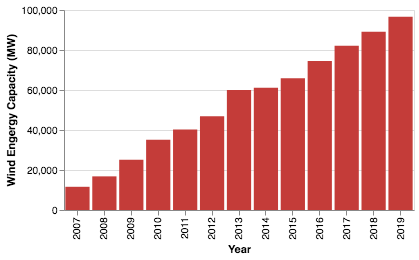
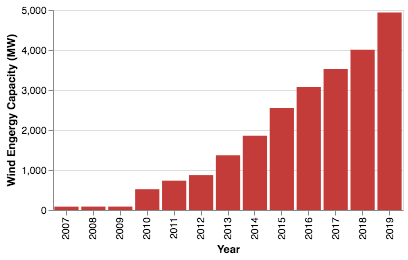
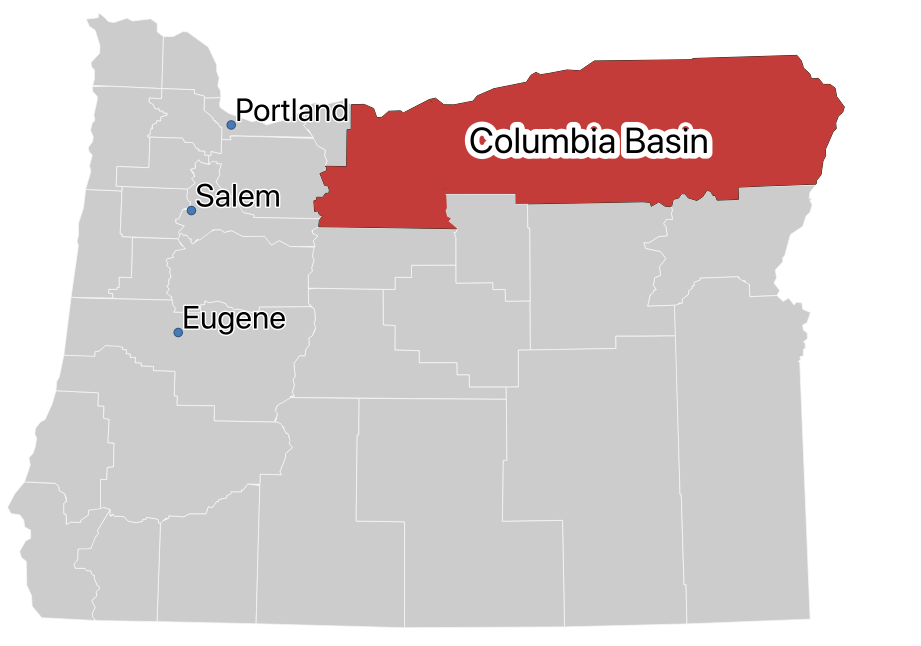
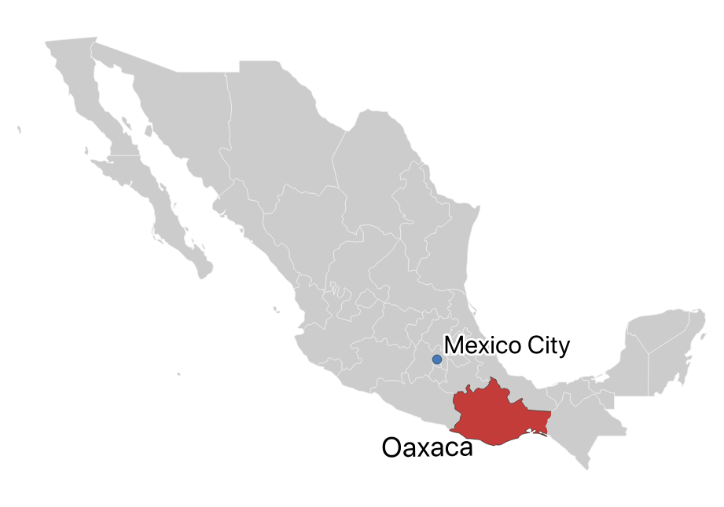
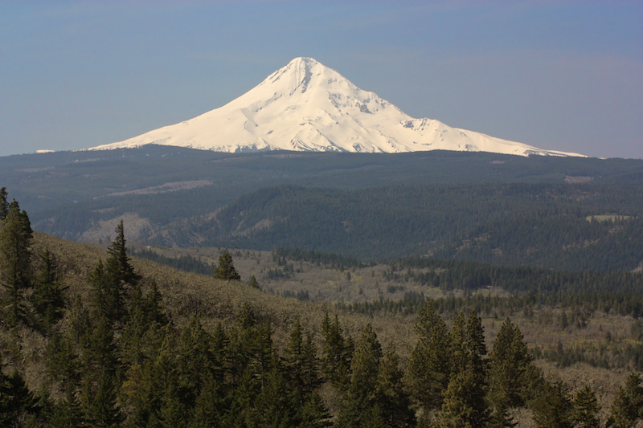
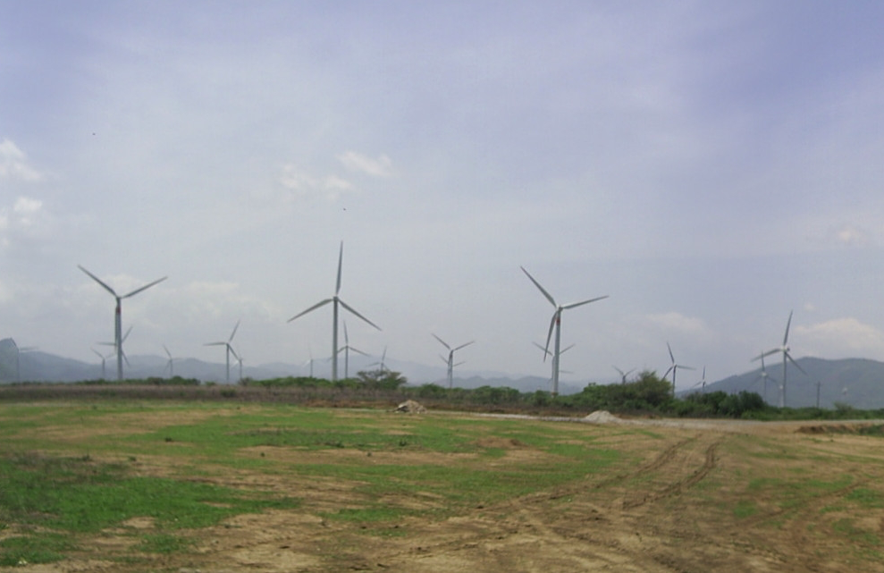

The content in this post has been adapted from an essay I recently wrote for a class in my masters program titled, "Economic Geography of Sustainability Transitions". For the essay, students were allowed to pick one area of currently undergoing sustainability transitions, and for me, wind energy was the most appealing area. This has to do with the strong impact wind energy has in the area I currently live in (Schleswig-Holstein in Germany), and wind energy's presence in the state where I am originally from (Oregon).

To take a look at potential controversies surrounding this energy source, I decided to examine two very different parts of the world: my home state Oregon in the United States and the State of Oaxaca in Mexico. 

<h2 id="introduction">Introduction</h2>

Wind energy projects have seen an unprecedented level of growth over the last 20 years. Many countries including China, the United States and Germany have all undertaken their own initiatives to promote these projects in order to promote their respective renewable energy portfolios. Support for these projects are often accepted by the general public at the national level, but as soon as the reality sets in that one of these installations may be constructed near residential areas or communities, local level opposition arises (Breukers and Wolsink <a href="#ref-breukers_wind_2007" role="doc-biblioref">2007</a>). That is not always the case, and sometimes these projects can obtain a large level of support, particularly when they promise to support the local economy and appropriately compensate those affected by the unwanted side-effects they bring (noise, shadow and visual impairment). To examine what contributes to the relative success and failure of these projects, we will examine two areas of the world which have large scale wind energy operations: the Columbia Basin located in the State of Oregon in the United States and the Isthmus of Tehuantepec region in the state of Oaxaca in Mexico.

To gain insight about what wind energy looks like in Oregon, I will rely on an empirical case study analysis performed by Yao Yin at Boise State University (<a href="#ref-yin_analysis_2013" role="doc-biblioref">2013</a>). It is important to note that Yin’s work focused exclusively on community wind farms, but it is my opinion that these projects also speak to and exemplify the wider debate and planning processes around wind energy in Oregon. For Mexico, we turn to a comprehensive study performed by Huesca-Pérez, Sheinbaum-Pardo, and Köppel (<a href="#ref-huesca_perez_social_2016" role="doc-biblioref">2016</a>). In this comprehensive study of the social strife around wind projects in Oaxaca Mexico, the authors provide a detailed background of the social structures and ethnic make-up of this region of Mexico. These two studies, along with other data gathered, will provide sufficient information to make our comparison.

To begin the comparison, we will examine the background of wind energy projects in both countries (United States and Mexico) examining the national impedance for pursuing them. Next, we describe the geography of the regions surrounding these wind farm installations also including an examination of the demographics. Afterwards, we will talk about specific wind energy projects in both Oaxaca and Oregon to get a clear idea of the social effects these projects have had. We conclude with a discussion aiming to understand why approaches of wind energy planning in Oaxaca result in negative social consequences and what ensures their relative success in Oregon.

<h3 id="national-background">National background</h3>

Wind energy interest was spurred in the United States after the 1973 oil crisis, and afterwards, a new era of development began that saw the construction of many wind farms in California (Kaldellis and Zafirakis <a href="#ref-kaldellis_wind_2011" role="doc-biblioref">2011</a>). This early development of wind energy even included a small scale 1.25 MW in Oregon on its southern coast (“Oregon Office of Energy - Wind Information” <a href="#ref-noauthor_oregon_nodate" role="doc-biblioref">n.d.</a>). Because of continued consumer demand for green energy, tax incentives for wind energy production and certain states pursuing a more aggressive transition to renewable energy sources, wind energy has continued to steadily grow across the United states (Bird et al. <a href="#ref-bird_policies_2005" role="doc-biblioref">2005</a>). The growth of wind energy in total Megawatt capacity is illustrated below.

  

    
USA wind energy capacity (MW)

    
  

  

    
Mexico wind energy capacity (MW)

    
  

  

    
<strong>USA</strong> 🇺🇸 

    
2019 total capacity

    
96.7 GW

  

  

    
<strong>Mexico</strong> 🇲🇽  

    
2019 total capacity

    
4.9 GW

  

  

    
Percent of total capacity

    
6.3%

  

  

    
Percent of total capacity

    
5.32%

  

  

    <i>Sources: <a href="https://en.wikipedia.org/wiki/Wind_power_by_country">Wikipedia: Wind Power by Country</a>, <a href="https://community.ieawind.org/about/member-activities">IEA Wind</a></i>
  

 

Although wind energy still makes up a relatively small percentage of domestic power generation in Mexico, it is expected to continue its strong growth, as seen in the chart above, by nearly 500% percent in the coming decade, mirroring the massive growth in wind energy production seen in the United States during the 2000s and 2010s (Huesca-Pérez, Sheinbaum-Pardo, and Köppel <a href="#ref-huesca_perez_social_2016" role="doc-biblioref">2016</a>). Mexico’s commitment to international agreements to reduce its green house gas emissions, coupled with a drive to ensure energy security are the primary drivers of this projected growth (Valenzuela and Qi <a href="#ref-valenzuela2012framing" role="doc-biblioref">2012</a>)

<h3 id="geographies-and-demographics">Geographies and demographics</h3>

  <h4 style="text-align: center">Oregon</h4>
  
  
    <b>Map 1</b> <i>Columbia Basin Eastern Oregon</i>
  

Moving from the national to the regional level, we first examine the region in which the overwhelming majority of Oregon’s wind farms are located: the Columbia Basin. The Columbia Basin is an area located in both Oregon and Washington. In Oregon, this area is characterized by rolling hills and dry grasslands (Anderson et al. <a href="#ref-anderson1998ecological" role="doc-biblioref">1998</a>). It is also sparsely populated with Sherman and Gilliam counties, the counties containing the ten largest wind farms in Oregon, only accounting for about 0.1% percent of Oregon’s total population (“U.S. Census Bureau QuickFacts: Oregon” <a href="#ref-noauthor_us_nodate" role="doc-biblioref">n.d.</a>; Hoen et al. <a href="#ref-hoen_united_2020" role="doc-biblioref">2020</a>). This population is also overwhelming white at nearly 88% (“U.S. Census Bureau QuickFacts: Oregon” <a href="#ref-noauthor_us_nodate" role="doc-biblioref">n.d.</a>).

  <h4 style="text-align: center">Oaxaca</h4>
  
  
    <b>Map 2</b> <i>State of Oaxaca in Southern Mexico</i>
  

The state of Oaxaca is located on the Isthmus of Tehuantepec in the southern part of the country near its border with Guatemala (see "Map 2"). The state of Oaxaca is characterized by rugged mountains and a diverse landscape and is the fifth largest state in Mexico (Schmal <a href="#ref-schmal_history_nodate" role="doc-biblioref">n.d.</a>). In contrast to the Columbia Basin’s near complete racial heterogeneity, Oaxaca has an incredibly diverse population with indigenous groups accounting for 47% of the total (Huesca-Pérez, Sheinbaum-Pardo, and Köppel <a href="#ref-huesca_perez_social_2016" role="doc-biblioref">2016</a>). This area also has some of the worst poverty rates in Mexico with 67% living in poverty and 25% living in extreme poverty which stands in stark contrast to the 12% poverty rate present in the Columbia Basin counties of Sherman and Gilliam (Huesca-Pérez, Sheinbaum-Pardo, and Köppel <a href="#ref-huesca_perez_social_2016" role="doc-biblioref">2016</a>; “U.S. Census Bureau QuickFacts: Oregon” <a href="#ref-noauthor_us_nodate" role="doc-biblioref">n.d.</a>).

<h3 id="two-cases-in-the-columbia-basin">Wind energy projects in the Columbia Basin</h3>

In the Columbia Basin, the majority of wind energy projects are owned and operated by large public utility companies such as Portland General Electric (PGE) (Oregonian/OregonLive <a href="#ref-oregonianoregonlive_pge_2010" role="doc-biblioref">2010</a>). But, there are also small players in the market, such as farmers and other property owners wishing to utilize their land for wind energy. Yin (<a href="#ref-yin_analysis_2013" role="doc-biblioref">2013</a>) conducted an analysis of several of these projects in the Columbia Basin in order to see what challenges they encountered. These projects were typically quite small ranging from 5 to 10 MW in size (about 5 to 8 wind turbines).

In order to help us determine what makes these projects fail or succeed, I have chosen to go over two projects belonging to each category. The first successful project is the PáTu Wind Farm which is owned by the Hilderbrand family in Sherman County. This project launched in 2010, installing six 1.5 MW wind turbines on their property and was the result of years of effort on the family’s part. The biggest impedance for this project was securing finances which was made more difficult due to the financial crisis in 2008. Ultimately, the funding was secured thanks in part to tax credits made available by the United States federal government. According to her analysis, Yin (<a href="#ref-yin_analysis_2013" role="doc-biblioref">2013</a>) reported that the social responses were very positive. The analysis refers to a public hearing where the county largely approved the project due to the ongoing acceptance on wind energy in the county in general. With a population density of roughly one person per square kilometer, we can also assume there simply were not very many people there to oppose the project in the first place.

  
  
    

      <i>Mt. Hood in Hood River County</i>
    

    

      <i>By Walter Siegmund, CC BY-SA 3.0, <a href="https://commons.wikimedia.org/w/index.php?curid=19096185">Wikimedia</a></i>
    

  

Another case mentioned in the analysis conducted by Yin (<a href="#ref-yin_analysis_2013" role="doc-biblioref">2013</a>) ended differently. During the planning of the Middle Mount Wind Project there was significant push back from the community which ultimately led to the complete halting of the entire project. Lying directly west of the PáTu Wind Farm, Hood River is one the most scenic counties in Oregon, attracting many tourist each year. One of the reasons for significant push back was the threat this wind project would pose to the region's scenery. This county also has a significantly higher population density of about 17 inhabitants per square kilometer (“U.S. Census Bureau QuickFacts: Oregon” <a href="#ref-noauthor_us_nodate" role="doc-biblioref">n.d.</a>). These means that no matter where these projects were going to be built, it would most likely end up in somebody's backyard, leading to grievances and opposition.

<h3 id="union-hidalgo-in-oaxaca">Wind energy in Unión Hidalgo</h3>

  
  
    

      <i>La Venta wind farm in Oaxaca, Mexico</i>
    

    

      <i>By Unknown Author, CC BY-SA 2.5, <a href="https://commons.wikimedia.org/w/index.php?curid=2467633">Wikimedia</a></i>
    

  

Our comparison now moves on to the wind project mentioned in the research conducted by Huesca-Pérez, Sheinbaum-Pardo, and Köppel (<a href="#ref-huesca_perez_social_2016" role="doc-biblioref">2016</a>). Some of the wind projects mentioned in the study are Juchitán de Zaragoza (the largest in the region), La Venta, Santo Domingo Ingenio, and Unión Hidalgo. Much like in the United States, all of these projects are owned by private companies. Because the land itself is already held by property owners, these companies typically lease the land for a 30 year period, but research by Huesca-Pérez, Sheinbaum-Pardo, and Köppel (<a href="#ref-huesca_perez_social_2016" role="doc-biblioref">2016</a>) uncovered that sometimes these purchases are conducted illegally, and in every case, land owners earn far less than their counterparts in other developed countries.

To exemplify the struggles around wind energy in Oaxaca, Huesca-Pérez, Sheinbaum-Pardo, and Köppel (<a href="#ref-huesca_perez_social_2016" role="doc-biblioref">2016</a>) selected a project in Piedra Larga in the municipality of Union Hidalgo. One very important difference to keep in mind when comparing this case with the previously mentioned cases in Oregon is the population density here. At about 140 inhabitants per square kilometer, the population density here is eight times higher than Hood River county where the Middle Mount Wind Project failed due to local opposition (“Unión Hidalgo (Gemeinde, Oaxaca, Mexiko) - Einwohnerzahlen, Grafiken, Karte Und Lage” <a href="#ref-noauthor_union_nodate" role="doc-biblioref">n.d.</a>). This fact means that the community will be in very close proximity to these projects and to make matters worse, there is currently no regulation in place in Mexico to establish a minimum distance that these wind turbines must be from population centers (Huesca-Pérez, Sheinbaum-Pardo, and Köppel <a href="#ref-huesca_perez_social_2016" role="doc-biblioref">2016</a>).

If that were not enough to ensure social conflict for this project, Huesca-Pérez, Sheinbaum-Pardo, and Köppel (<a href="#ref-huesca_perez_social_2016" role="doc-biblioref">2016</a>) also report that there was virtually no consultation with the public to even notify local communities of these installations let alone provide them a platform to voice their concerns. The stands in stark contrast to the public consultation policies that were pursued in Hood River and Sherman County in Oregon. Because of this lack of consultation, Huesca-Pérez, Sheinbaum-Pardo, and Köppel (<a href="#ref-huesca_perez_social_2016" role="doc-biblioref">2016</a>) go on to report that community members in Union Hidalgo were not able to voice their concerns about the wind energy project’s effect on tree removal, water pollution and noise pollution among others. This total disregard for community member input of any kind is indicative of a top-down approach to wind energy implementation which further promotes existing class divides, especially in such a poor region of the country.

<h2 id="conclusion">What can we learn from this comparison?</h2>

Even during this brief overview, we can clearly see that the approaches to implementing wind energy projects in Oregon and Oaxaca differ drastically. As Huesca-Pérez, Sheinbaum-Pardo, and Köppel (<a href="#ref-huesca_perez_social_2016" role="doc-biblioref">2016</a>) report, there are pieces of the process, especially around lease agreements, which are prone to corruption in Oaxaca. What Huesca-Pérez, Sheinbaum-Pardo, and Köppel (<a href="#ref-huesca_perez_social_2016" role="doc-biblioref">2016</a>) also imply is regional and national governments have a closer alliance with the wind energy companies in Oaxaca than they do with the local populations. The current level of poverty and illiteracy present in Oaxaca also makes it easier for governments and wind energy companies to be less responsive to their needs. But, despite all these challenges, farmers and indigenous groups are mobilizing to make their voices heard (EJOLT <a href="#ref-ejolt_ejatlas_nodate" role="doc-biblioref">n.d.</a>). In Oregon, we see large scale wind energy developments just like in Oaxaca, but there these projects are planned in areas with very low population density and public opinion is actually solicited during development. These steps cause minimal societal impact and help ensure the future of wind energy projects in this region.

Obviously, Oaxaca and Oregon are two very different regions of the world with different geographies and governments, but it does not mean that the citizens of these respective regions deserved to be handled any differently when it comes to planning and implementing wind energy projects. Communities in both of these regions deserve to have active roles in the planning of these projects, and when negative externalities affect the quality of their lives, they also deserve to be compensated appropriately. These feats can only be accomplished when governments are responsive to their citizenry and actively engage them in the decision making process. The transition towards renewable energy sources should not forget this fact and should ensure that this development is conducted sustainably to ensure the support of these projects by local communities.

<h2 class="unnumbered" id="references">References</h2>

Anderson, E William, Michael M Borman, William Clement Krueger, and others. 1998. “The Ecological Provinces of Oregon: A Treatise on the Basic Ecological Geography of the State.”

Bird, Lori, Mark Bolinger, Troy Gagliano, Ryan Wiser, Matthew Brown, and Brian Parsons. 2005. “Policies and Market Factors Driving Wind Power Development in the United States.” <em>Energy Policy</em> 33 (11): 1397–1407. <a href="https://doi.org/10.1016/j.enpol.2003.12.018">https://doi.org/10.1016/j.enpol.2003.12.018</a>.

Breukers, Sylvia, and Maarten Wolsink. 2007. “Wind Power Implementation in Changing Institutional Landscapes: An International Comparison.” <em>Energy Policy</em> 35 (5): 2737–50. <a href="https://doi.org/10.1016/j.enpol.2006.12.004">https://doi.org/10.1016/j.enpol.2006.12.004</a>.

EJOLT. n.d. “EJAtlas.” Accessed February 23, 2020. <a href="https://ejatlas.org">https://ejatlas.org</a>.

“Electricity Generation from Wind - U.S. Energy Information Administration (EIA).” n.d. Accessed February 24, 2020. <a href="https://www.eia.gov/energyexplained/wind/electricity-generation-from-wind.php">https://www.eia.gov/energyexplained/wind/electricity-generation-from-wind.php</a>.

Hoen, B. D., J. E Diffendorfer, J. T. Rand, L. A. Kramer, C. P. Garrity, and H. E. Hunt. 2020. “United States Wind Turbine Database.” U.S. Geological Survey, American Wind Energy Association,; Lawrence Berkeley National Laboratory. <a href="https://eerscmap.usgs.gov/uswtdb">https://eerscmap.usgs.gov/uswtdb</a>.

Huesca-Pérez, María Elena, Claudia Sheinbaum-Pardo, and Johann Köppel. 2016. “Social Implications of Siting Wind Energy in a Disadvantaged Region – the Case of the Isthmus of Tehuantepec, Mexico.” <em>Renewable and Sustainable Energy Reviews</em> 58 (May): 952–65. <a href="https://doi.org/10.1016/j.rser.2015.12.310">https://doi.org/10.1016/j.rser.2015.12.310</a>.

Kaldellis, John, and D Zafirakis. 2011. “The Wind Energy (R)evolution: A Short Review of a Long History.” <em>Renewable Energy</em> 36 (7): 1887–1901. <a href="https://doi.org/10.1016/j.renene.2011.01.002">https://doi.org/10.1016/j.renene.2011.01.002</a>.

Oregonian/OregonLive, Ted Sickinger The. 2010. “PGE Completes Final Phase of Biglow Canyon Wind Farm.” <em>Oregonlive</em>. <a href="https://www.oregonlive.com/business/2010/09/pge_completes_final_phase_of_b.html">https://www.oregonlive.com/business/2010/09/pge_completes_final_phase_of_b.html</a>.

“Oregon Office of Energy - Wind Information.” n.d. Accessed February 24, 2020. <a href="http://sites.science.oregonstate.edu/~hetheriw/projects/energy/topics/doc/solar/wind/app/or/Oregon_Office_of_Energy_-_Wind_Information.html">http://sites.science.oregonstate.edu/~hetheriw/projects/energy/topics/doc/solar/wind/app/or/Oregon_Office_of_Energy_-_Wind_Information.html</a>.

Schmal, John P. n.d. “History of Mexico - the State of Oaxaca.” Accessed February 24, 2020. <a href="http://www.houstonculture.org/mexico/oaxaca.html">http://www.houstonculture.org/mexico/oaxaca.html</a>.

“Unión Hidalgo (Gemeinde, Oaxaca, Mexiko) - Einwohnerzahlen, Grafiken, Karte Und Lage.” n.d. Accessed February 25, 2020. <a href="https://citypopulation.de/php/mexico-oaxaca_d.php?adm2id=20557">https://citypopulation.de/php/mexico-oaxaca_d.php?adm2id=20557</a>.

“U.S. Census Bureau QuickFacts: Oregon.” n.d. Accessed February 24, 2020. <a href="https://www.census.gov/quickfacts/fact/table/hoodrivercountyoregon,gilliamcountyoregon,shermancountyoregon,OR/PST045219">https://www.census.gov/quickfacts/fact/table/hoodrivercountyoregon,gilliamcountyoregon,shermancountyoregon,OR/PST045219</a>.

Valenzuela, Jose Maria, and Ye Qi. 2012. “Framing Energy Efficiency and Renewable Energy Policies: An International Comparison Between Mexico and China.” <em>Energy Policy</em> 51: 128–37.

Yin, Yao. 2013. “An Analysis of Empirical Cases of Community Wind in Oregon.” <em>Renewable and Sustainable Energy Reviews</em> 17 (January): 54–73. <a href="https://doi.org/10.1016/j.rser.2012.09.020">https://doi.org/10.1016/j.rser.2012.09.020</a>.

