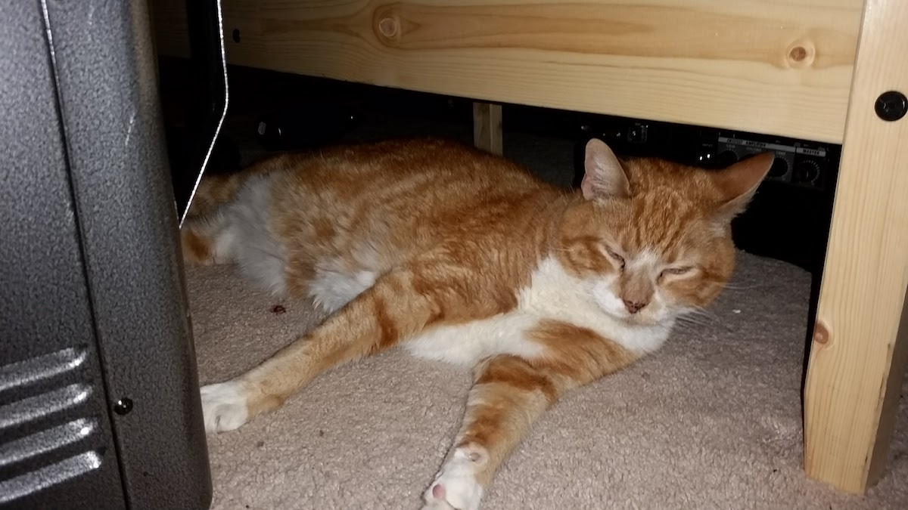
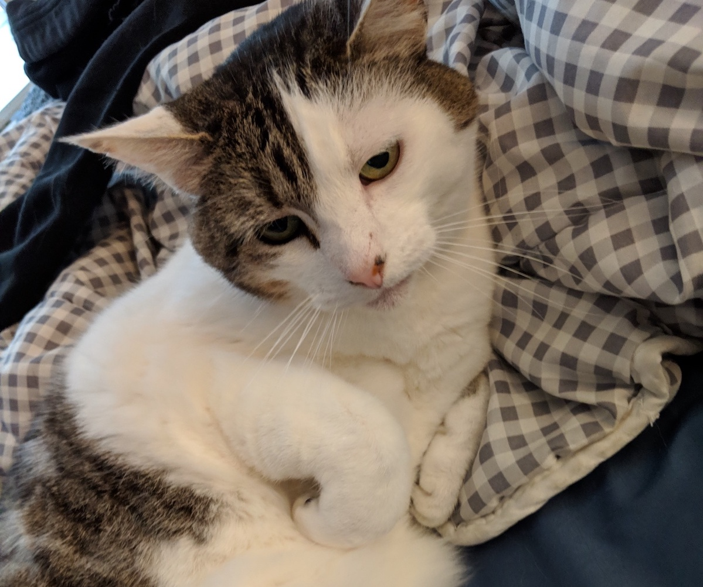
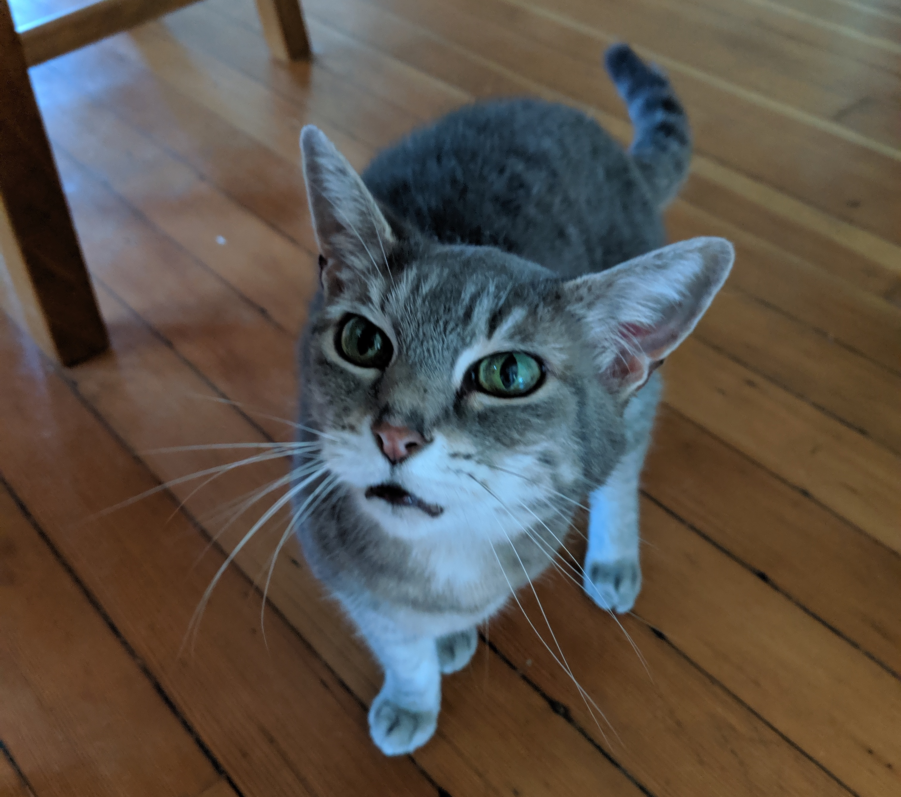
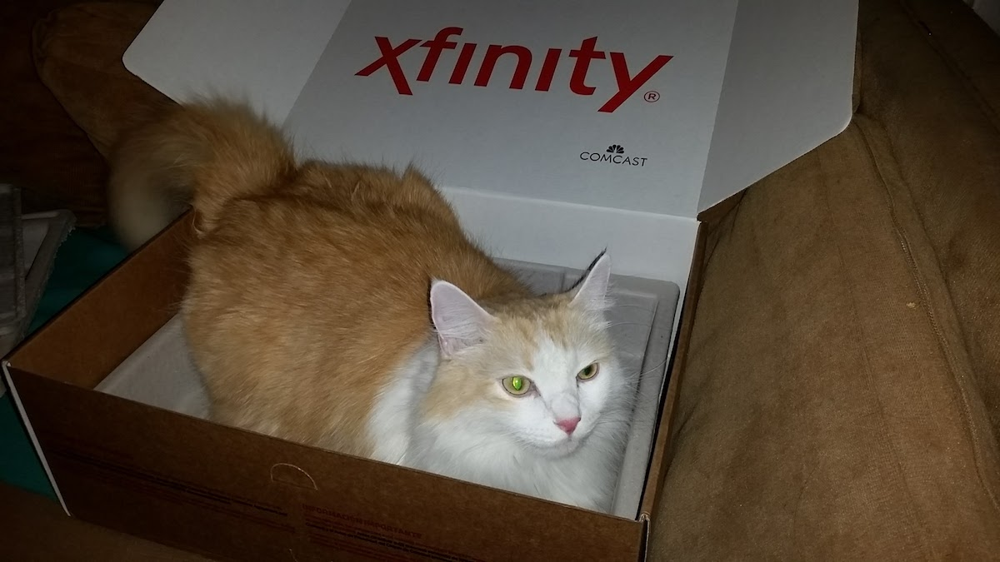
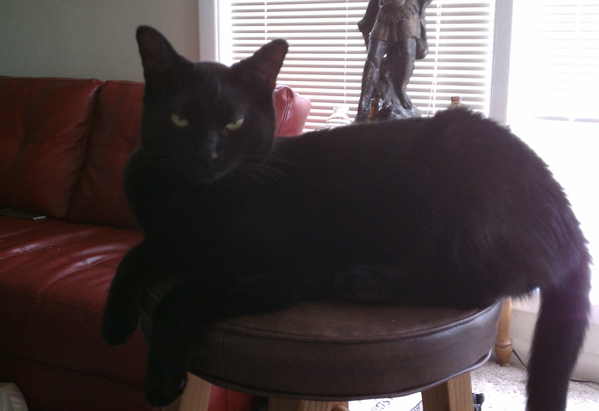
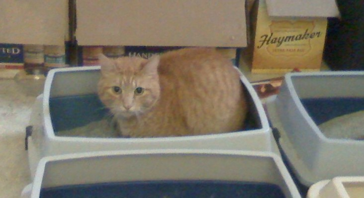
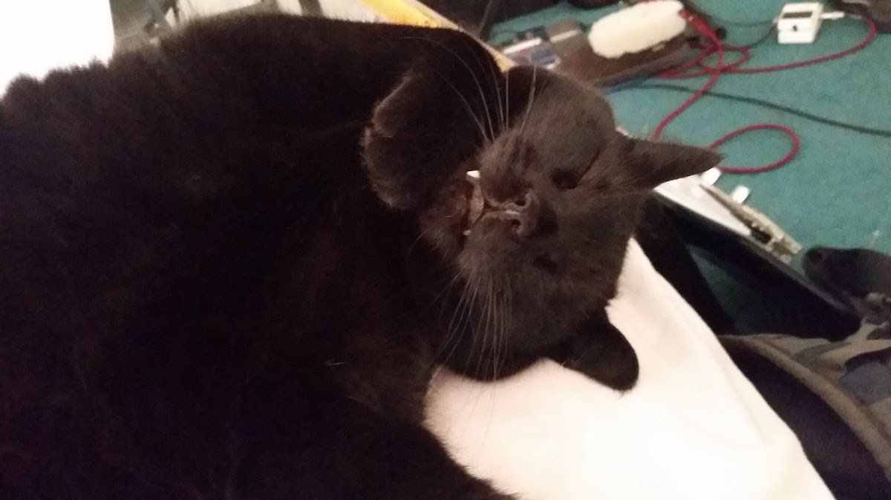

Let me start this post off by sayig I'm not a *cat* person. I love animals of all shapes and sizes, but in my life particularly, it appears as though cats have been the animal I have come in to closest and most frequent contact with (second only to dogs). Therefore, I see it fit to share a collection of the fine felines I have met over the years. I give my sincere thanks to all of these beautiful animals for allowing me make their acquaintance, and I hope I have the opportunity to meet many more in the coming years.

## Oscar

Oscar was one of the most unique cats I have ever had the pleasure knowing (yes, unfortunately he's no longer with us). Like most cats he really liked eating food, and he was also quite clever. At one point during his life, he had actually figured out how to unscrew the container containing his cat food. This meant that we always had to leave a brick on top of this container after feeding him to prevent him from accessing the unlimited food source.

## Dilly

Dilly is hands down my favorite cat of all time. Her temperament has the perfect mixture of wanting to be pet sometimes but also likes to be left alone. She makes the perfect foot warmer when sleeping in your bed and has an incredibly soft coat. 10 out of 10.

## Shadow

Shadow is a small grey cat. So small that sometimes my friends mistake her for still being a kitten. What she lacks in size she makes up for in volume as she likes to talk (a.k.a. meow). She's very fond of sitting in your lap and being pet, but watch out, because if she enjoys herself too much, she will start farting and drooling all over you!

## Fassal

Do not let this cat-in-a-box's seemingly calm demeanor fool you. Fassal will scratch, bite and hiss. It took me nearly a year and a half just to be able to touch this cat's head without having to make a trip to the emergency room. Once you break the tough veneer, he's actually quite sweet, but prepared to shed blood while doing so.

## Huey

Growing up, I had a black cat named Felix. Ever since then I have always had a soft spot in my heart for this type of cat. Aside from Felix, Huey is the one of my favorite black cats. Huey is super goofy and likes to flop around on the ground a lot. He always seems to remember who I am, and gets really excited whenever he sees me.

## Sammy

This picture describes Sammy pretty well. The little guy was definitely a weirdo which is why we used to call him "psycho-salmonella". Unfortunately, he was definitely the runt of the group and always got beat up on, but we eventually gave him up to a better home where he didn't have as much competition.

## Mr. Derp

Mr. Derp as his name implies was pretty derpy. He belonged to an old roommate of mine, and we got the chance to hangout quite a bit.

That's it for now. I hope to keep making additions to these page (or perhaps a second version) in the years ahead.
