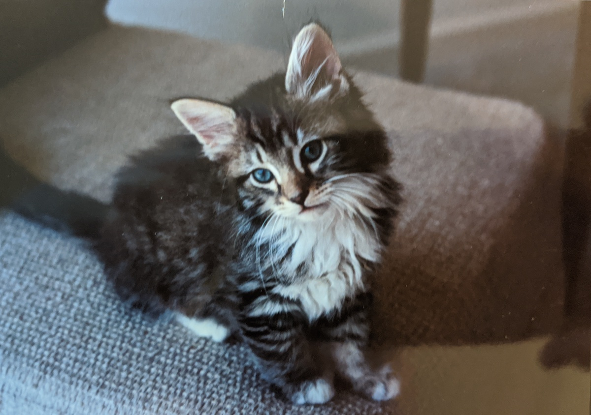

Because of the popularity of the first post, I decided to write another one after being provided with a nice trove of pictures of several cats from my childhood.

## Felix

  
  
  

Felix was the first black cat I ever met. We got him when I was about one year old or so. It was a cool experience growing up with a cat who was about as old you were, and I spent a lot of time with him growing up. This guy made it just about 18 years. Not a bad run for a cat!

## Zack

  
  
  

Our family got Zack right around when we got Felix, so they were just about the same age (maybe even from the same litter if I am not mistaken). Zack really liked being outside and would occasionally get in to trouble. This led to a racoon (or something) taking a decent size chunk of his ear off.

## Tigger

  
  

Tigger, named after the Winnie the Pooh character, was my brother's cat (if I remember correctly, I had just gotten a new dog, so he got a cat). He was a pretty cool cat, but would occasionally freak out. I had to save him from getting stuck on a mattress that had been laid on its side once (his claws were stuck in the mattress).

