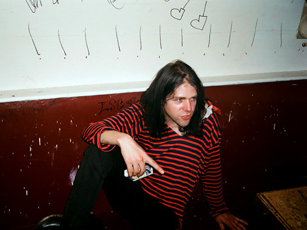
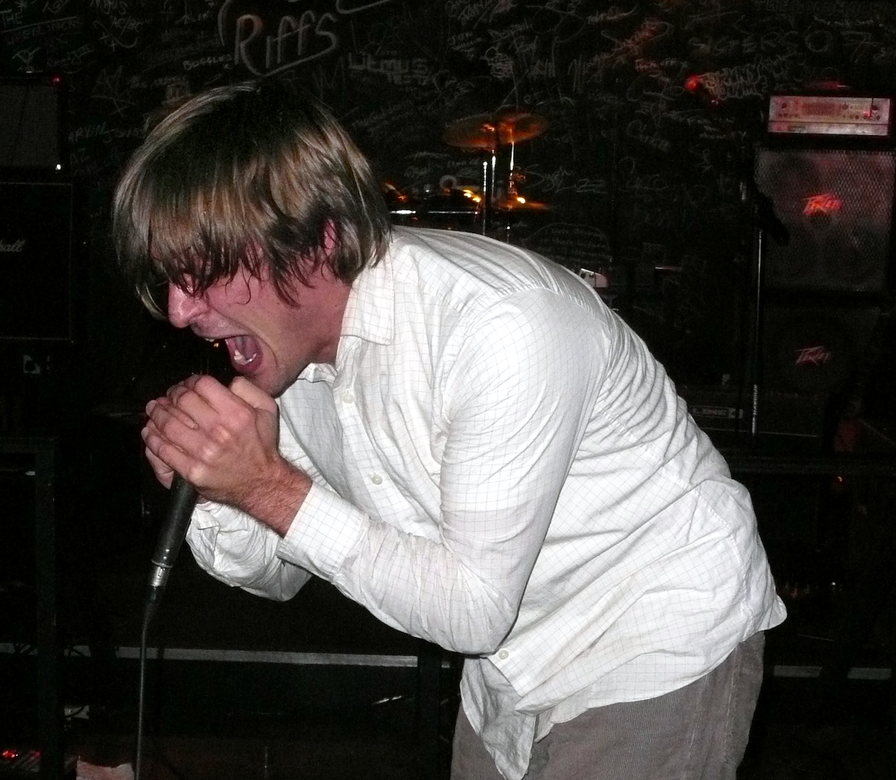
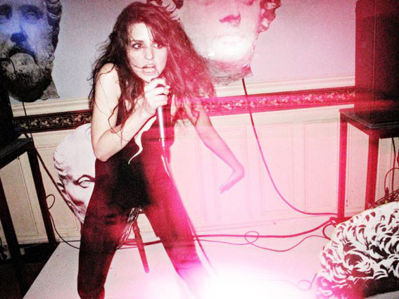
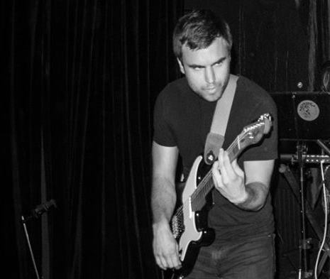

To me, weirdness in music is something that differentiates the boring, monotonous parade of coporate approved music you hear on the radio between the novel, unique gems you discover through word of mouth or by pillaging through records at your local music store. Being weird is not something that one actively strives for but purely a categorization of ones own creation relative to others in retrospect. In music, there is no such thing as something that is completely unique and original. Everything is borrowed and tweaked. Therefore, the weirdness I will introduce comes from artist who have done this borrowing and tweaking in an exceptional manner.

Obviously, tastes in music are highly subjective, and everyone has their favorite bands and songs. In many cases, someone's interest in music really is an intergral part of who they are as a person. This has especially been the case for myself throughout my life. So, to give you a better picture of my interests and where they came from, I think it is important to briefly introduce myself through the lens of music.

## The journey begins...

My tastes in music really started to change around when I was 13 years old. At this time of my life, I was making lots of new friends who were introducing me to some really interesting bands. For first time in my life, the music I listened to did not come from the radio but from recommendations. The first truly weird album I bought at this time was Mr. Bungle's self title. This album is already weird enough, but it was especially so for a 13 year old who's previous record collection only included, "Dr. Dre", "Eminem", "Greenday" and "The Offspring".

As I moved on to high school, I started playing guitar, and my interest in metal balloned. This also began an obsession I had with guitar solos, and during this phase, I remember having so much disdain for any song without one, "wait... there's no solo in this song? Do people even call this music?" This obsession had the nice side-effect of pushing me as a player, but I am very happy that I finally got over it.

After highschool is when I really started to branch out in to playing other genres of music. I discovered the local Jazz radio station in Portland. I took a really cool class in college called, "Funk Guitar". I actually began trying to sing in a manner that did not involve screaming my guts out in front of a microphone. For lack of a better term, my interests were *diversifying*. So, it was around this time that I began discovering the artist I am about to introduce...

## Ariel Pink

  

    
  

  
    Stevenviney at English Wikipedia / CC BY-SA
  

The first musician was my introduction in to the genre of "Lofi Pop Music". Ariel Pink's music was definitely unique to me at the time, especially his album "Scared Famous". These tracks sounded like they were recorded with the cheapest gear possible but resulted in something aesthetically pleasing. This was the same technique employed by the founders of the second of wave of Black Metal in Norway. By toning the production quality, you had an opportunity to create an entirely new experience for the listener, and the music had a much more organic and natural feel than the polished glossyness of most music today.

For someone who recorded music for the most part by themselves in their bedroom, this had some pretty big implications. It showed me that a professional studio is not necessary to make great music, and this helped inspire me to let go of those preconceptions and to just work with what I had on hand.

To get an idea of what this sounds like, check out Ariel Pink's "Are You Gonna Look After My Boys" off "Scared Famous"

##### Are You Gonna Look After My Boys?

<iframe style="border: 0; width: 100%; height: 42px;" src="https://bandcamp.com/EmbeddedPlayer/album=1333654230/size=small/bgcol=ffffff/linkcol=0687f5/track=1981467111/transparent=true/" seamless><a href="http://arielpinkshauntedgraffiti.bandcamp.com/album/ff">FF &gt;&gt; by Ariel Pink&#39;s Haunted Graffiti</a></iframe>

## John Maus

  

    
  

  
    By adrigu, CC BY 2.0, <a href="https://commons.wikimedia.org/w/index.php?curid=60787488">Wikimedia</a>
  

John Maus also belongs to the genre of "Lofi", and his albums are filled with all kinds of idiosyncrasies including the musical arrangements to the lyrical content. The musical arrangements typically involve at least a drum machine, several synths, a bass and Maus' booming echoing vocals. When I heard these arrangements, it helped nudge me in to trying an approach to composition that didn't involve using a guitar (pretty big shock for a guitar player). The second of Maus' idiosyncrasies were his lyrics. Sometimes these lyrics seemed to be expressing a serious political statement like in his song, "Rights for Gays", but often he will quickly return to the realm of sarcasm and absurdity as is the case with one of his more recent songs, "Your Pets are Going to Die".

All of Maus' albums also seem to have a sort melancholic aspect laying at their foundation. I simply could not name a Maus song that is particularly bright and poppy. For me particularly, this is an aspect in music I am particularly drawn to. When I look at a lot of music I have written, I would say the majority is certainly melancholic and gloomy.

What better way to explore this melancholy and gloom than with a song about rockets literally flying towards your house.

##### Pure Rockets

<iframe style="border: 0; width: 100%; height: 42px;" src="https://bandcamp.com/EmbeddedPlayer/album=3582152042/size=small/bgcol=ffffff/linkcol=0687f5/track=3375977265/transparent=true/" seamless><a href="http://johnmaus.bandcamp.com/album/love-is-real">Love Is Real by John Maus</a></iframe>

## Geneva Jacuzzi

  

    
  

  
    From <a href="https://www.discogs.com/de/artist/1205579-Geneva-Jacuzzi#images/4397644">Discogs</a>
  

I first heard Geneva Jacuzzi's music actually pretty recently (in the last 4 years). The album that really captivated me was her latest full length studio album "Technophelia". In this album, she really combines so much of what I really enjoy from typical 80s synth-pop but adds her own irreplaceable weirdness to the mix that really makes this something unique. The voices shes uses on her albums vary and avoid the typical pop music female vocals we are so used to hearing. Her lyrics are also super weird and leave a lot to the imagination as far as deciphering their meaning.

Out of everyone I have introduced so far, I think Jacuzzi's music was really that which left me with an overwhelming sense of envy as to what she was capable of creating. After hearing her albums, I just really wanted to sit down and work out some ideas of my own to see what I was able to come up with.

To see what I am talking about, check out her song "God Maker" off her album "Technophelia".

##### God Maker

<iframe style="border: 0; width: 100%; height: 42px;" src="https://bandcamp.com/EmbeddedPlayer/album=2083891623/size=small/bgcol=ffffff/linkcol=0687f5/track=4021171317/transparent=true/" seamless><a href="http://medicalrecords.bandcamp.com/album/technophelia-mr-053">Technophelia (MR-053) by Geneva Jacuzzi</a></iframe>

## ...and finally myself

  

    
  

  
    Myself onstage with Megaton Leviathan (circa 2017)
  

The common thread amongst everyone I have introduced is that they mostly produce music under the single musician moniker (except Ariel Pink with his band "Haunted Graffiti"). I am not particularly social and finding the right mix of musicians to create with is really hard for me. This means that an overwhelming majority of the time when I create music, it is done by myself. Seeing these musician as individuals (whether or not the music itself was created in that manner) does provide a drive of inspiration to go about it alone too. For that, I am very grateful.

To give you an idea of where this inspiration leads me personally, I have collected two of the weirder/funnier songs I have recorded. The first one is called "Deep State", and includes my imagination of what being indoctrinated as a CIA must be like:

##### Deep State

<iframe width="100%" height="166" scrolling="no" frameborder="no" allow="autoplay" src="https://w.soundcloud.com/player/?url=https%3A//api.soundcloud.com/tracks/982249615&color=%23d9d7d8&auto_play=false&hide_related=false&show_comments=true&show_user=true&show_reposts=false&show_teaser=true"></iframe>
<a href="https://soundcloud.com/travis-hathaway" title="Travis Hathaway" target="_blank" style="color: #cccccc; text-decoration: none;">Travis Hathaway</a> · <a href="https://soundcloud.com/travis-hathaway/deep-state" title="Deep State" target="_blank" style="color: #cccccc; text-decoration: none;">Deep State</a>

 

The second song is called "Violent People" and has some pretty self-explanatory lyrics. It was recorded in a time when I was living in a dark, dank basement, and I like to think that this mood also comes through on the track. 

##### Violent People

<iframe width="100%" height="166" scrolling="no" frameborder="no" allow="autoplay" src="https://w.soundcloud.com/player/?url=https%3A//api.soundcloud.com/tracks/338755244&color=%23d9d7d8&auto_play=false&hide_related=false&show_comments=true&show_user=true&show_reposts=false&show_teaser=true"></iframe>
<a href="https://soundcloud.com/travis-hathaway" title="Travis Hathaway" target="_blank" style="color: #cccccc; text-decoration: none;">Travis Hathaway</a> · <a href="https://soundcloud.com/travis-hathaway/violent-people" title="Violent People" target="_blank" style="color: #cccccc; text-decoration: none;">Violent People</a>

Thanks for taking to the time to learn more about myself and the music that really inspires me to create my brand of weirdness for the world.
