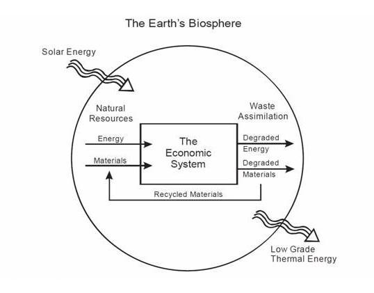

<h2 id="introduction">Introduction</h2>

Technology being a double edged sword is an old adage that has repeatedly played out during the history of technological development. That the same technology we use to make our world a more livable and hospitable place can be used against us to affect the opposite is by now well understood. In the 20th century alone, one can count numerous instances of technologies initially conceived to make our world a better place, such as nuclear energy, later resulting in unforeseen negative consequences. But did the worldview of the technology’s creators play a role in their lack of caution? And did the comfort of this worldview provide the creators with hubris to continue their advancements in the face of negative consequences?

With Nuclear technology specifically, we can see a pattern of hubris in its development and the desire of humanity wishing to transcend its abilities in harnessing the power of the Sun. Initially created for its destructive purposes, nuclear technology was later adapted to help power our cities. To aid in this technology’s implementation in the United States, the Atomic Energy Act of 1946 was signed in to law by President Harry S. Truman (Buck <a href="#ref-buck_atomic_1983" role="doc-biblioref">1983</a>). The commissioner’s first head, Lewis Strauss, was famously quoted as saying that one day nuclear energy would be, “to cheap to meter” (Lester <a href="#ref-lester_environmental_1992" role="doc-biblioref">1992</a>). This clearly did not come to pass in the ensuing decades, but nuclear development would continue amongst ever greater concerns of the dangers of nuclear fallout and the safety and reliability of the reactors themselves (Buck <a href="#ref-buck_atomic_1983" role="doc-biblioref">1983</a>). Not only that, but the development of these technologies were also costly from an economic perspective, relying often of government subsidies to keep projects afloat (Lester <a href="#ref-lester_environmental_1992" role="doc-biblioref">1992</a>).

This paper aims to understand the underlying belief systems that support the continued developments of such technologies despite the cost and risks they bear on society. To do this, we must first understand the roots of the mechanical worldview, how it came about and helped determine the pace of modern life. To illustrate an example of this mechanical worldview in modern times, we will examine the field of environmental economics. Subsequently, we will examine what it means when humans have a dominating role over there natural environment. We finally conclude with an examination of carbon capture and sequestration (CCS) and its history to see what evidence there is that this new technology may be fitting in to past patterns of hubris and human domination of nature.

Throughout this paper, I will be borrowing from the work that has already been conducted on this topic from Hård and Jamison (<a href="#ref-hard_hubris_2013" role="doc-biblioref">2013</a>). In their book, “Hubris and Hybrids”, they set off to explore a history of technology and its appropriation. Ultimately, they argue that successful appropriation of technology involves taming the <em>hubris</em> which is fundamental to the innovative spirit of humanity while simultaneously creating <em>hybrid</em> identities which can account for the necessary technical and social aspects of invention. What this paper will add is a discussion about the role that humanity’s relationship to nature plays in the hubris of innovation. I intend to argue that this hubris is strongly influenced by a mechanical worldview which simplifies the complexity of nature and the belief that humans dominate their natural surroundings. Simplifying assumptions and domination of nature go hand-in-hand and allow overconfidence and hubris to grow in an unbounded manner, resulting in some of our current environmental catastrophes.

<h2 id="roots-of-mechanical-worldview">Roots of mechanical worldview</h2>

During the enlightenment era, the development of Newtonian physics helped create the roots of a mechanical philosophy that would set a foundational narrative for modernity (Hård and Jamison <a href="#ref-hard_hubris_2013" role="doc-biblioref">2013</a>, 23). With this narrative it was now possible to explore the once mysterious realms of nature and precisely predict the movements of heavenly bodies such as the Moon, Sun and stars. During this time too, we would see the removal of animist and vitalist theories, and in doing so, the mechanical philosophy of nature would remove the life out of nonhuman nature (23). Accompanying this mechanical philosophy was also a more utilitarian worldview involving a separation between “useful knowledge” and “idle speculation” (24). This separation would be necessary in a society trending more and more towards capitalistic structures of organization (24).

The ever greater role of machines in the west would also lead these cultures to the point where the pace of life itself would be adapted to the pace and capacities of the machine. Although this mechanisation had been prevalent in other cultures, it would be only the western cultures of Europe which would take it to this point (Mumford <a href="#ref-mumford_technics_2010" role="doc-biblioref">2010</a>, 4). The mechanical world view from the enlightenment helped give rise to the domination of the machines described by Mumford (<a href="#ref-mumford_technics_2010" role="doc-biblioref">2010</a>) during the industrial and late industrial era. One example of this domination was the advent of reliable mechanical watches and the development of time zones (Du and Xie <a href="#ref-du_mechanics_2012" role="doc-biblioref">2012</a>). With these innovations, it was not just parts of the machines that were synchronized to each other’s movements but entire societies. When combined with the advent of electricity and lighting, we would see our societies moving less with natural rhythms of day and night and more with our socially constructed 24 hour diurnal cycles.

Mechanical philosophy still affects the discourse of many subjects in a variety of ways. Terms such as “political forces” and “social pressures” illustrate this (Hård and Jamison <a href="#ref-hard_hubris_2013" role="doc-biblioref">2013</a>, 23). Specifically in the fields of social sciences, these terms paint the picture that politics and economics are just functional aspects of a larger machine producing outputs given their inputs. We use the language of “broken politics” or a “broken economy” which then leads to the thought that the appropriate institutions may be able to step in and “fix” these parts by making a couple “tweaks” to return them to functioning order once more.

The abstraction of the machine is a powerful concept and has been equally extended to the way we refer to nature and natural phenomena. An example of this would be the usage of the term “force of nature” describing the “power” unleashed during a storm or other deadly natural event. During hurricanes and earthquakes we prefer to conceptualize their power in a quantified nature by using corresponding scales. This allows us to greatly simplify their complexity and organize these natural phenomena in to neat categories much like we categorize the strength of engines for automobiles.

Since the era of enlightenment, priority has been given to fields of knowledge which lend themselves to quantification and utilitarian purposes versus those fields in which the qualitative knowledge acquired in and of itself was the end goal (Hård and Jamison <a href="#ref-hard_hubris_2013" role="doc-biblioref">2013</a>, 24). This can be seen clearly in today’s world with society’s relentless pursuit to quantify all aspects of life. Several examples include China’s policy of citizen rating, credit scores in the USA and even seemingly benign examples such as temperature. As stated before, the constant quantification is a precept for the proper functioning of an amoral, calculated capitalist economic system in which we all find ourselves today. When improvements of narrowly defined goals of quantification are given precedence, we are with left misappropriations of technological know-how that largely neglect humanitarian and ecological needs.

<h2 id="mechanical-worldview-of-environmental-economics">Mechanical worldview of environmental economics</h2>

How this mechanization is applied to our modern view of nature can be seen through the lens of environmental economics in our modern age. Shown in figure one is a diagram of resource flows through an economy (“Ecological Economics” <a href="#ref-noauthor_ecological_2020" role="doc-biblioref">2020</a>). In this sub-discipline of economics, the Earth is viewed as a closed system only obtaining energy from the Sun which is then transformed into natural resources for use within the global economy. One of the goals of environmental economics is solving the “sustainability problem” or figuring out how we can support all the humans inhabiting the earth today contained within the Earth’s biosphere (Perman et al. <a href="#ref-perman_natural_2003" role="doc-biblioref">2003</a>, 16).

  <b>Figure 1</b> <i>Diagram describing resource flow through the economy</i> (“Ecological Economics” <a href="#ref-noauthor_ecological_2020" role="doc-biblioref">2020</a>)

The way of perceiving this process is a fundamentally mechanical one and even relies on the first and second laws of thermodynamics at its base (Perman et al. <a href="#ref-perman_natural_2003" role="doc-biblioref">2003</a>, 49). Among other things, these laws are fundamental in understanding the operation of physical machines, but when we try to extend this same mindset to global environmental processes, differences in scale immediately arise and greatly reduce its accuracy. Instead, what we are left with are methods that must make simplifications in understanding incredibly complex systems.

While operating under these simplifications we believe that nature is purely a machine that can be infinitely tweaked to our needs as a species. An example of this is this tweaking and manipulation of so called “carbon offsets”, which promise to fully compensate the loss of carbon dioxide capture in one area with the increase of carbon capturing ability in another. Therefore, the removal a forest in one area could be justified for the planting of trees in another. This type of mindset which lends itself to thinking of nature as swappable components of a machine, providing some sort of service beneficial to humanity, robs nature of all the other values it has. This is so because we deny all other aspects of a forest (biodiversity, cultural heritage, etc.) and choose to solely focus on the utilitarian aspects (carbon capture).

Economist choose to value nature as components in a machine because they believe this is the only way we can provide these resources with monetary value and therefore include them in economic decision making processes (Perman et al. <a href="#ref-perman_natural_2003" role="doc-biblioref">2003</a>, 399). Commonly referred to as “Environmental Valuation”, these techniques value the environment as the amount of utility they provide society. When discussing whether or not a forest should be removed in favor of a mining operation, it becomes necessary at some point to enumerate all the perceived benefits of this forest. The inherit problem here is that there is no exact way to do this, and this process is therefore heavily subject to the bias of the creators during this valuation. In my opinion, the potential for bias renders this technique to be at best useless and at worst a tool for promoting the hubris of developers believing they have thoroughly accounted for all valuable aspects of a complex ecosystem.

<h2 id="human-domination-of-nature">Human Domination of Nature</h2>

Along with the mechanical philosophy which emerged during the enlightenment era, we also saw a pattern of human domination of nature. This domination resulted in the unbridled growth and expansion of western civilization to all corners of the earth, the genocides of numerous indigenous groups and cultures, and the exploitation of natural resources. Crist (<a href="#ref-crist_affliction_2017" role="doc-biblioref">2017</a>) refers to this as the “Affliction of Human Supremacy”, and describes this phenomena arising as part of a historical pattern of <em>anthroprocentrisism</em>. One example shes cites is the Christian “Great Chain” of being where man has been placed above animals and minerals guaranteeing these aspects of existence belong to his dominion.

It is where this sense of dominance and technical abilities cross that trouble arises. Crist (<a href="#ref-crist_affliction_2017" role="doc-biblioref">2017</a>) cites the example of the take-over of the American Plains as a prime example of this. She explains that neither technical prowess nor human supremacist ideas alone could have accomplish the destruction of the buffalo and indigenous cultures, but rather a combination of the two resulting in a lived worldview of the domination of nature. With this technical know-how and dominating spirit also comes a sense a hubris that humanity has the power to do more that it really can.

Evidence of this hubris and spirit of domination can be readily accessed in works such as Billington and Hedges (<a href="#ref-billington_westward_1949" role="doc-biblioref">1949</a>) account of westward expansion in, “Westward Expansion: A History of the American Frontier”. Their accounts of westward expansion rely on a narrative describing the outer bounds of westward expansion as, “the meeting point of savagery and civilization, the zone where civilization entered the wilderness…” (Billington and Hedges <a href="#ref-billington_westward_1949" role="doc-biblioref">1949</a>, 3). This account continues on with even more blatantly racist, supremacist language when referring to first wave of fur trader exploration,

<blockquote>

“They broke down the Indian self-sufficiency, accustoming the red men to the guns, knives, and firewater of the white men’s higher civilization. They weakened the natives by spreading disease and vices among them, or by providing some tribes with the guns that led to the slaughter of their wilderness enemies” (Billington and Hedges <a href="#ref-billington_westward_1949" role="doc-biblioref">1949</a>, 4)

</blockquote>

The words “white men’s higher civilization” and “their wilderness enemies” truly speak to where white settlers saw themselves in relation to nature; clearly at the top and therefore permitting a dominant role which legitimized a genocidal brutality wiping many of these cultures off the map completely.

<h2 id="carbon-capture-and-sequestration">Carbon Capture and Sequestration</h2>

To take a closer look at how a mechanical worldview and dominating spirit of nature affect our decisions in the debate of appropriate actions to take in order to curb climate change, we now take a look at the field of CCS. The movement to this technology began in earnest during the early 90s and since then, researchers have been devising ways in which they could potentially remove carbon dioxide from the atmosphere, especially from large point emitters such as power generation facilities (Herzog <a href="#ref-herzog_peer_2001" role="doc-biblioref">2001</a>). The CO2 captured from such processes could be used for commercial purposes, but our demand for such CO2 is far overshadowed by the amount we create: nearly 1 to 1,000 (Herzog <a href="#ref-herzog_peer_2001" role="doc-biblioref">2001</a>). This means we need to store this excess CO2 somewhere, and the list of possible reservoirs include the ocean, deep saline formations (underground), depleted oil and gas reservoirs, and coal seams (underground).

<h3 id="current-development-in-japan">Current development in Japan</h3>

In Japan, one such project for capturing CO2 and storing it deep underground is well underway. In the northern Island of Hokkaido sits a new facility aimed at testing this procedure and has to date nearly 300,000 tons of CO2 in depths of thousands of meters below the ground sequestered (Fritz <a href="#ref-fritz_japan_2020" role="doc-biblioref">2020</a>). The motivation for such actions comes from participation with the international community in order to meet the demands of the 2015 Paris Agreement, which urges nations to take actions to reduce their CO2 emissions to maintain a rise in global temperatures of no more than two degrees Celsius (“The Paris Agreement UNFCCC” <a href="#ref-noauthor_paris_nodate" role="doc-biblioref">n.d.</a>). This reduction in CO2 can be achieved in a variety of ways such as switching to renewable energy sources like wind or solar or achieving efficiency gains which result a net decrease of energy usage. In this case, Japan has chosen to experiment with a third option: retrofitting existing fossil fuel based systems to capture CO2 and store it in underground reservoirs.

To further reduce CO2 emissions many countries have switched to policies of emissions taxing (Perman et al. <a href="#ref-perman_natural_2003" role="doc-biblioref">2003</a>, 207). Emission taxes are a popular way to limit the single point emissions from large emitters such as power plants or other industrial facilities. In order to enact this tax, a government must set a per unit tax on a specific type of emission (CO2 in our case) and enforces this to ensure the private sector pays its fair share for the pollutants they emit. In theory, this provides an incentive for companies to reduce their emissions for the sake of paying a lower tax, or when the tax becomes so burdensome, to find alternatives which involve not creating this pollutant at all.

The president of the firm promoting CCS in Japan, Japan CCS Co., Ltd., has stated that if these taxes continue to increase, it could present an opportunity for companies using CCS to save considerable amounts of money even when factoring in the cost of retrofitting existing infrastructure (Fritz <a href="#ref-fritz_japan_2020" role="doc-biblioref">2020</a>). This development occurs despite the controversies surrounding CCS in Japan. Critics of this method say CCS poses a risk of increased seismic activity and therefore earthquakes (Fritz <a href="#ref-fritz_japan_2020" role="doc-biblioref">2020</a>). These concerns are warranted given the controversies surrounding fracking, a technology which also injects liquid underground, and the earthquakes it causes (Ellsworth <a href="#ref-ellsworth_injection_induced_2013" role="doc-biblioref">2013</a>). According to a report following an earthquake in the vicinity of its test CCS Facility, Japan CCS Co., Ltd. stated there was no reason to believe this was cause by the CCS facility, and it was part of normal seismic activity in the region (Japan CCS Co. <a href="#ref-japan_ccs_co_ltd_research_2018" role="doc-biblioref">2018</a>).

<h3 id="implications-of-this-project">Implications of this project</h3>

In the case of CCS in Japan, the jury is still out concerning the potentially dangerous side-effects of such operations, but we can still discuss the role of the previously discussed mechanical worldview philosophy, human domination of nature and signs of hubris present in this approach. In their report assuring the public that there CCS installation had no effects on the recent seismic activity in the area, Japan CCS Ltd., Co. makes references to the computer simulations they used in order to predict pressure in the various geological formations they were affecting. Although the process of simulation is an important one, it is one which lends itself to vast simplifications, as no computer model is complex enough to accurately reflect the true complexity of the Earth and all of its interactions. To use the help of a metaphor, these scientist are currently stuck in a dark cave with a very useful tool: a flashlight, but this flashlight is only effective if they point it in the right direction in order to get clear sense of their surroundings.

Hubris makes its appearance when these scientist feel assured that they have used their simulations in the most appropriate way possible. These numbers and statistics may even be backed up by observations in the real world (the report by Japan CCS Ltd., Co. also mentions a high level of monitoring). With each observation, comes a greater sense of security and confidence, but there could also be dangers with their technology that have not been accounted for. This may ultimately lead to a disaster calling the usage of this technology in to question. The underlying mentalities pushing this forward are the mechanical worldview which help these scientists make their simplifying assumptions, and the dominating role humanity currently has in nature. In combination, these assure the scientists that they can continue manipulating the natural world in whatever way they see fit as long as it serves the purposes of humanity and the perceived risks are low enough.

<h2 id="conclusion">Conclusion</h2>

In writing this paper, I hoped to show the ways in which modern societies are still very much prone to technological hubris and using technology to give us a false sense of security about our role and abilities as a species. To correct these errors, it is not my wish to adopt the ways of a Luddite, but rather to foster a sense of healthy skepticism towards technology, especially with how it influences our perception of and place in the natural world around us. Our technical abilities have now reached the point where humanity has extraordinary powers of creation and destruction. It is therefore of utmost importance that we use these powers responsibly and take an overly cautious position when developing new technologies. In doing so, we can hopefully slow down the appropriation process and hopefully stem the flood of unintended negative consequences coming from these technologies.

<h2 class="unnumbered" id="references">References</h2>

  

  
Billington, Ray Allen, and James Blaine Hedges. 1949. <em>Westward Expansion: A History of the American Frontier</em>. Macmillan Company.

  

  

  
Buck, Alice. 1983. “The Atomic Energy Commission.” <em>U.S. Department of Energy</em>, July, 42. <a href="https://www.energy.gov/sites/prod/files/AEC%20History.pdf">https://www.energy.gov/sites/prod/files/AEC%20History.pdf</a>.

  

  

  
Crist, Eileen. 2017. “The Affliction of Human Supremacy.” <em>The Ecological Citizen</em> 1 (1): 61–64.

  

  

  
Du, Ruxu, and Longhan Xie. 2012. <em>The Mechanics of Mechanical Watches and Clocks</em>. Springer Science &amp; Business Media.

  

  

  
“Ecological Economics.” 2020. <em>Wikipedia</em>. <a href="https://en.wikipedia.org/w/index.php?title=Ecological_economics&amp;oldid=943897367">https://en.wikipedia.org/w/index.php?title=Ecological_economics&amp;oldid=943897367</a>.

  

  

  
Ellsworth, William L. 2013. “Injection-Induced Earthquakes.” <em>Science</em> 341 (6142). <a href="https://doi.org/10.1126/science.1225942">https://doi.org/10.1126/science.1225942</a>.

  

  

  
Fritz, Martin. 2020. “Japan - 300.000 Tonnen C02 Unter Dem Meeresboden.” News. <em>Deutschlandfunk</em>. <a href="https://www.deutschlandfunk.de/japan-300-000-tonnen-c02-unter-dem-meeresboden.676.de.html?dram:article_id=468706">https://www.deutschlandfunk.de/japan-300-000-tonnen-c02-unter-dem-meeresboden.676.de.html?dram:article_id=468706</a>.

  

  

  
Hård, Mikael, and Andrew Jamison. 2013. <em>Hubris and Hybrids : A Cultural History of Technology and Science</em>. Routledge. <a href="https://doi.org/10.4324/9781315024400">https://doi.org/10.4324/9781315024400</a>.

  

  

  
Herzog, Howard J. 2001. <em>Peer Reviewed: What Future for Carbon Capture and Sequestration?</em> ACS Publications.

  

  

  
Japan CCS Co., Ltd. 2018. “Research Report on Impacts of Hokkaido Eastern Iburi Earthquake on CO2 Reservoir.” Japan CCS Co., Ltd. <a href="https://www.japanccs.com/wp/wp-content/uploads/2019/09/Research-Report-on-Impacts-of-Hokkaido-Eastern-Iburi-Earthquake-on-CO2-Reservoir_2nd-edition.pdf">https://www.japanccs.com/wp/wp-content/uploads/2019/09/Research-Report-on-Impacts-of-Hokkaido-Eastern-Iburi-Earthquake-on-CO2-Reservoir_2nd-edition.pdf</a>.

  

  

  
Lester, James P. 1992. <em>Environmental Politics and Policy: Theories and Evidence</em>. Macmillan International Higher Education.

  

  

  
Mumford, Lewis. 2010. <em>Technics and Civilization</em>. University of Chicago Press.

  

  

  
Perman, Roger, Yue Ma, James McGlvray, and Michael Common. 2003. <em>Natural Resorce and Environmental Economics</em>. Pearson Education.

  

  

  
“The Paris Agreement UNFCCC.” n.d. Accessed March 18, 2020. <a href="https://unfccc.int/process-and-meetings/the-paris-agreement/the-paris-agreement">https://unfccc.int/process-and-meetings/the-paris-agreement/the-paris-agreement</a>.

  

