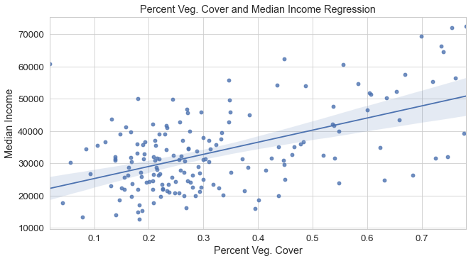

<h2 id="introduction">Introduction</h2>

The city of Portland, Oregon and Multnomah County are located in the Pacific North West of the United States. This area is characterized by moderate temperatures, rainy winters, a valley and plenty of trees. Forest Park, one of the largest city parks in the United States covered in miles of windy trails and urban forest, represents the city’s commitment to maintaining forested areas within the city. The park itself is located near the center of the city and surrounded by the beautiful neighborhoods of Northwest Portland. This is a unique place in the city which offers refuge for those who need an escape from the hectic nature of city life.

But, when we zoom out and examine the park’s geographical context, we also see that Forest Park is surrounded by some of the wealthiest neighborhoods in Portland with median incomes well above city average (U.S. Census Bureau <a href="#ref-us_census_bureau_american_2018" role="doc-biblioref">2018</a>). It should be no surprise that one of the largest and well known parks in Portland also belongs to one of its wealthiest neighborhoods. Wealth in the United States not only guarantees a better lot in life but also easier access to publicly funded resources such as parks, schools and roads. This happens because the income of many cities is tightly linked to the revenue they make from property taxes. Therefore, the more collective value a neighborhood or city has, the more money it has for better public infrastructure. This uneven development of urban environments is an unfortunate side-effect of what most of us have come to accept as a natural part of life.

In this essay, I venture to understand what effects the uneven development of Portland and Multnomah County’s urban development has for its residents, and in order to do this, I will be looking specifically at the relationship between vegetation/canopy cover and median household income. The work done here was largely inspired by research performed by Heynen (<a href="#ref-heynen_green_2006" role="doc-biblioref">2006</a>) in Indianapolis where he asked whether changes in income corresponded to changes in urban canopy cover. Just like Heynen (<a href="#ref-heynen_green_2006" role="doc-biblioref">2006</a>), I will also embed this analysis in the field of Marxist Urban Political Ecology by using both quantitative and qualitative approaches. The quantitative approach relies on satellite imagery and US Census Bureau data and the qualitative analysis will examine the historic, political and ecological context of the city of Portland and Multnomah County.

<h2 id="the-natural-world-of-a-city">The Natural World of a City</h2>

Before starting with our case specific analysis of Portland, it is necessary to introduce readers to some of the important concepts underlying Marxist Urban Political Ecology (UPE). This particular flavor of UPE can be thought of as a sub-set focusing primarily on how labor relations shape urban environments and ecosystems. In my opinion, the two most important concepts to understand from this field are what Smith (<a href="#ref-smith_production_2008" role="doc-biblioref">2008</a>) refers to as the “production of nature” and the idea of our “metabolic” relationship to nature first alluded to by Marx himself (Heynen <a href="#ref-heynen_urban_2014" role="doc-biblioref">2014</a>).

The production of nature as Smith (<a href="#ref-smith_production_2008" role="doc-biblioref">2008</a>) refers to it, is a relationship to the natural world which puts labor squarely in the middle. According to this theory, in order for human beings to survive, it becomes necessary at some point to extract <em>use-values</em> from the natural environment (food, water, shelter, etc.) in order to ensure a stable community. As societies develop further and become agrarian, they also gain the ability to create surpluses (e.g. stored wheat or grain) to survive during harsh times as well as good times. When the surplus grows beyond the society’s ability to consume it, societies can trade their surpluses with each other to obtain other types of beneficial goods. When this occurs, they have created resources which have <em>exchange-value</em>. In order to make exchanges more efficient, currencies are developed, which ultimately leads to what we recognize as a modern capitalist system.

The following quote from Smith (<a href="#ref-smith_production_2008" role="doc-biblioref">2008</a>) eloquently elaborates the direct consequences of such a system:

<blockquote>

With production for exchange, the relation with nature is no longer exclusively a use-value relation; use-values are not produced for direct use but for exchange… In an exchange economy, the appropriation of nature is increasingly regulated by social forms and institutions, and in this way, human beings begin to produce more than just the immediate nature of their existence. (p. 59-60)

</blockquote>

Surpluses in societies necessitate some form of social institutional control, and because these institutions control the production process, they then mediate our relationship to nature. These institutions are produced by humans themselves and therefore we are the ones responsible for how we mediate our own relationship to nature. Furthermore, because this mediation process is uneven, greater wealth guarantees greater access to natural resources and the drive to acquire wealth leads to an overconsumption of natural resources. This uneven relationship to nature is responsible for the uneven distributions we see in our cities and societies and in my opinion, is also the essence of what Smith (<a href="#ref-smith_production_2008" role="doc-biblioref">2008</a>) means when he talks about the uneven production of nature.

Metabolism in this context is a metaphor used to describe the way our societies metabolizes natural resources which provide energy for the system to sustain itself. Or as Swyngedouw (<a href="#ref-swyngedouw_city_1996" role="doc-biblioref">1996</a>) puts it, “as a dynamic process by which new socio-spatial formations, intertwining of materials, and collaborative enmeshing of social nature emerge and present themselves and are explicitly created through human labor and non-human processes simultaneously.” When this metaphor is used, I believe we become more inclined to think of cities as the vibrant living things they are rather than the static images of concrete and steel buildings comprising the cityscapes we are so accustomed to. Keeping this in mind, it is easy to see that we are constantly re-inventing these “socio-spatial formations” and therefore how our societies mediate their relationship to nature.

When we recognize that we that we are responsible for the production of our own nature and that our own social institutions mediate our relationship to it, we begin break down what Smith (<a href="#ref-smith_production_2008" role="doc-biblioref">2008</a>) refers to as the dualism in our conception of nature. This dualism is the idea that there simultaneously exists two concepts of the natural world: one that is present within us, so-called <em>human nature</em>; and one that is present outside ourselves, <em>external nature</em>. This dualism has played a big role in our collective imaginations of the natural world and according to popular UPE has also acted to limit the our creativity for solving problems within urban environments (Heynen <a href="#ref-heynen_urban_2014" role="doc-biblioref">2014</a>). In the following sections, I focus specifically on the produced environment of Portland and how its social and ecological environments are tightly linked.

<h2 id="portlands-socio-natural-landscape">Portland’s Socio-Natural Landscape</h2>

So, what does Portland’s metabolic process look like and what role has this metabolic process played in its uneven development? As with many cities in the American West, this was a process of systematic displacement and resource exhaustion. The Chinook, Clackamas and Multnomah tribes among others were some of the first groups to feel the brunt of this displacement as white European settlers arrived from the east (Welala Long <a href="#ref-welala_long_urban_2019" role="doc-biblioref">2019</a>). As these new colonizers moved in, tribes were systematically displaced and forced on to reservation land. Often tribes were forced to sign treaties which granted them rights to land but were then subsequently disrespected and broken leading to cycles of displacement and abuse, something common in North America at this time.

The displacement of minority groups would also continue in to the 20th century in the city of Portland. This time displacement came in the form of gentrification and targeted the African American community in North Portland. Historically, like in many parts of the United States, African American communities were forced to live in certain areas of the city because of racist, segregationist policies, and for African Americans in Portland this was the Albina neighborhood in the North. Beginning in the 1990s, this neighborhood, widely seen as “economically depressed”, became the target for new development because of its proximity to downtown and many historical buildings which maintained their “historical charm” (Hern <a href="#ref-hern_what_2017" role="doc-biblioref">2017</a>). Subsequently, the Albina neighborhood has seen a steady increase in white residents and a steady decrease in its African American residents (Hern <a href="#ref-hern_what_2017" role="doc-biblioref">2017</a>). Gentrification in Albina had the effect of eliminating one of Portland’s only minority communities while simultaneously pushing African American residents to less desirable areas of the city.

Alongside this displacement of people was an extraction of exchange-value and use-value from the natural environment which permanently shaped the landscape into what we now recognize as Portland. Timber was available in large quantities and had a huge impact on the built environment in Portland, which led to many buildings and structures being constructed out of wood (Engeman <a href="#ref-engeman_wooden_2005" role="doc-biblioref">2005</a>). This speed of natural resource extraction left its mark on the city which adopted the nickname “Stumptown” because of the many tree stumps left in place during the city’s expansion. As well as being the supply of domestic timber, much of this wood was exported from Oregon to support other areas such as California and Hawaii (Engeman <a href="#ref-engeman_wooden_2005" role="doc-biblioref">2005</a>).

Of the many species of trees one can find in Oregon, it is the conifer species that are the most dominant (Lang <a href="#ref-lang_conifers_2018" role="doc-biblioref">2018</a><a href="#ref-lang_conifers_2018" role="doc-biblioref">b</a>). These include species such as the Douglas-fir, Western Red Cedar and Western Hemlock. Of those three tree species, it was the Western Red Ceder that had the most significant value to indigenous populations in Oregon. Their resistance to moisture and rot made them an invaluable resource in the pacific northwest’s damp and cool climate, and one could use them to make a startling variety of objects including dishes, coffins, canoes, boxes, clothing, mats and houses (Lang <a href="#ref-lang_western_2018" role="doc-biblioref">2018</a><a href="#ref-lang_western_2018" role="doc-biblioref">a</a>). Economically, one the most valued tree species in the western part of Oregon was and still is the Douglas-fir because of its versatility for use in wood products (Lang <a href="#ref-lang_douglas-fir_2019" role="doc-biblioref">2019</a>). Alongside its economic values, Douglas-fir trees are also very common in the urban environment of Portland (see table 1 for most common trees in Portland Parks).

<table class="table-condensed" style="width:60%; margin-right: auto; margin-left: auto">
<caption>Most common tree species in Portland parks Portland Parks and Recreation (<a href="#ref-portland_parks_and_recreation_parks_2017" role="doc-biblioref">2017</a>)</caption>
<colgroup>
<col style="width: 27%" />
<col style="width: 31%" />
</colgroup>
<thead>
<tr class="header">
<th style="text-align: left;">Common Name</th>
<th style="text-align: right;">Total Number of trees</th>
</tr>
</thead>
<tbody>
<tr class="odd">
<td style="text-align: left;">Douglas-fir</td>
<td style="text-align: right;">6,783</td>
</tr>
<tr class="even">
<td style="text-align: left;">Norway Maple</td>
<td style="text-align: right;">1,502</td>
</tr>
<tr class="odd">
<td style="text-align: left;">Western Red Cedar</td>
<td style="text-align: right;">964</td>
</tr>
<tr class="even">
<td style="text-align: left;">Northern Red Oak</td>
<td style="text-align: right;">736</td>
</tr>
<tr class="odd">
<td style="text-align: left;">Pin Oak</td>
<td style="text-align: right;">619</td>
</tr>
</tbody>
</table>

<h2 id="vegetation-cover-and-income-analysis">Vegetation cover and income analysis</h2>
<h3 id="method">Method</h3>

In an effort to combine both natural and societal aspects of a city, an analysis of Portland was performed using satellite imagery data and median income data. The study area was Multnomah county, which includes several municipalities the largest being the cities of Portland and Gresham with total populations of 653,467 and 109,379, respectively (U.S. Census Bureau <a href="#ref-us_census_bureau_us_2020" role="doc-biblioref">2020</a>). In order to compare differences within the study area of vegetation cover and median income, census tracts were used (see figure 2 for an overview of these census tracts). This scale was chosen because it was the smallest available scale with median income data.

  
  
  <b>Figure 1</b> <i>Median Income Multnomah County 2017</i> (U.S. Census Bureau <a href="#ref-us_census_bureau_american_2018" role="doc-biblioref">2018</a>)
  

  
  
    <b>Figure 2</b> <i>NDVI Multnomah County July 25th, 2019</i>
  

The satellite imagery used came from the European Space Agency’s (ESA) Sentinel 2 project, and the imagery data was available in a 10 meter pixel resolution. At this resolution, it is not possible to differentiate individual trees, but it is possible to roughly determine sealed areas (buildings, roads, parking lots, etc.) versus vegetated/canopied areas. The satellite imagery used was collected on July 25th, 2019. This date was chosen because deciduous as well coniferous trees were fully visible during this time of year. This day in particular also had exceptionally low cloud cover further increasing the quality of data. The median income data used in the analysis came from the 2017 American Community Survey conducted by the US Census Bureau (data table <code>B06011_001E</code>).

To measure vegetation in the study area, the Normalized Difference Vegetation Index (NDVI) was used and values greater than <code>0.6</code> determined whether a pixel was high vegetation or not (Herring and Weier <a href="#ref-herring_measuring_2000" role="doc-biblioref">2000</a>). To calculate percentage vegetation cover, the number of pixels which met the criteria for high vegetation (NDVI &gt; <code>0.6</code>) was divided by the total number of pixels for the census tracts. A map of the NDVI values is presented in figure 3.

<h3 id="results">Results</h3>

A regression analysis was conducted to examine the relationship between our two variables: vegetation cover and median income. The results of the analysis are shown in figure 4 and show the independent variable, “percentage vegetation cover” accounts for approximately 28.7% change in the dependent variable, “median income”. We can see from this very simple analysis that there is in fact a positive correlation between the amount of money that one earns and the likelihood that one also lives in an area with higher vegetation/canopy cover. The results should not be taken as conclusive proof of such inequity, but they do reveal a tendency in Portland that favor wealthier neighborhoods.

  
  
  <b>Figure 3</b> <i>Vegetation Cover and Median Income Regression Plot</i>
  

<table style="width:60%; margin-left: auto; margin-right: auto; margin-bottom: 40px">
<caption style="text-align: center">R-Squared values for regression analysis</caption>
<colgroup>
<col style="width: 20%" />
<col style="width: 9%" />
</colgroup>
<thead>
<tr class="header">
<th style="text-align: left;">Statistic</th>
<th style="text-align: right;">Value</th>
</tr>
</thead>
<tbody>
<tr class="odd">
<td style="text-align: left;">R-Squared</td>
<td style="text-align: right;">0.287</td>
</tr>
<tr class="even">
<td style="text-align: left;">Adj. R-Squared</td>
<td style="text-align: right;">0.283</td>
</tr>
</tbody>
</table>
<h2 id="discussion">Discussion</h2>

The findings of this small scale analysis of vegetation cover and median income reveal trends in uneven urban development that Hoffman, Shandas, and Pendleton (<a href="#ref-hoffman_effects_2020" role="doc-biblioref">2020</a>) also found in their national study. In addition to vegetation cover, Hoffman, Shandas, and Pendleton (<a href="#ref-hoffman_effects_2020" role="doc-biblioref">2020</a>) analyzed urban heat and found that formerly redlined neighborhoods were consistently warmer than other neighborhoods. For readers who are not aware, redlining was a racially motivated policy prevalent throughout the early 20th century in the United States which ensured that minority neighborhoods received less credit and loans from banks (Hillier <a href="#ref-hillier_redlining_2003" role="doc-biblioref">2003</a>). This all but guaranteed that these neighborhoods were systematically disadvantaged and made sure that they were not able to receive the kinds of credit and loans to help spur development.

The warmer temperatures reported by Hoffman, Shandas, and Pendleton (<a href="#ref-hoffman_effects_2020" role="doc-biblioref">2020</a>) mean that these communities will be more vulnerable to heat wave events that are projected to occur more often in the years to come (Peng Roger D. et al. <a href="#ref-peng_roger_d_toward_2011" role="doc-biblioref">2011</a>). As it currently stands, this seems to be yet another tragic chapter in the history of uneven urban development. But, as previously stated, cities, just like any natural environment, are not static but dynamic landscapes in which we continuously have the opportunity to reinvent. We will close this essay by looking at a policy being implemented in Portland which may help ensure future generations live in a more equitable urban landscape.

This is a concerted effort by the city to increase its urban canopy cover by planting more trees throughout the city and spreading them equitably. One of the organizations helping Portland achieve these goals is the Friends of Trees non-profit organization founded in 1989 by Portland resident Richard Seidman (“Tree Planting Programs” <a href="#ref-noauthor_tree_nodate" role="doc-biblioref">n.d.</a>). In 2018, the organization planted 4,451 new trees and they also, “add trees to underserved, low-canopy neighborhoods through going door-to-door with information about our program, and providing trees at no cost if price is a barrier” (Friends of Trees <a href="#ref-friends_of_trees_friends_2018" role="doc-biblioref">2018</a>). Not only are they helping to affect change in the city’s natural environment but by engaging thousands of volunteers, the organization also actively promotes environmental education while simultaneously fostering a sense of community.

Acknowledging the importance of urban canopy cover and the obligation to spread this benefit equitably across the city and county is also part of the city of Portland and Multnomah County’s “Climate Change Action Plan” (The City of Portland <a href="#ref-the_city_of_portland_2015_2015" role="doc-biblioref">2015</a>). In the plan, it is acknowledged that steadily increasing temperatures will disproportionately affect low-income and minority communities the most. A series of proposals are put forth in the action plan including tree planting programs like friends of trees as well as promoting the use of natural and green infrastructure. One prominent natural infrastructure project in Portland are so-called “green streets” (see figure 4), which promote the use of more urban vegetation as a means to filter runoff water before it re-enters the city’s streams and rivers (The City of Portland <a href="#ref-the_city_of_portland_green_nodate" role="doc-biblioref">n.d.</a>)

  

    
  

  
    <b>Figure 4</b> <i>Green street installation on SE Ankeny St.</i> (The City of Portland <a href="#ref-the_city_of_portland_green_nodate" role="doc-biblioref">n.d.</a>)
  

Planting more trees and creating green streets seem rather idealistic and fit in well with what Swyngedouw (<a href="#ref-swyngedouw_impossible_2010" role="doc-biblioref">2010</a>) terms as the “Fantasy of Sustainability”, and yes, these attempts risk becoming purely a, “series of technological, managerial and organisational fixes” with no real significance for addressing the concerns of a disadvantaged minority. But, in my opinion these ideas fit in with a greater societal transformation required to empower communities to not only directly combat the adverse effects of climate change but also combat the uneven development of capitalist societies. These policies fit in well with what we have previously discussed as taking an active role in shaping the metabolic process of a city, and the programs are political in nature in that they acknowledge the minority’s right to a clean and safe environment while giving them a voice.

<h2 id="conclusion">Conclusion</h2>

It will certainly be exciting to see whether or not the city of Portland and Multnomah County will be a able to truly equitably spread its “Climate Change Action Plan” and what effect this will have on its urban forest in the coming decades. As I have shown here with my own small scale analysis, the effects of uneven development are indeed real and go beyond pure conjecture and anecdotal claims. The initiatives to combat this are taking place both on the grass-roots level as well as within the institutions of the city and county governments. Going forward, this grass-roots and institutional cooperation will be incredibly important. We will need the grass-roots as a means to raise concerns and shine the light on inequities, and in order for anything meaningful to be accomplished, these issues must be institutionalized so that they are able to affect real change within our cities.

<h2 class="unnumbered" id="references">References</h2>

Engeman, Richard. 2005. “Wooden Beams and Railroad Ties: The History of Oregon’s Built Environment: Topics.” <a href="https://www.oregonhistoryproject.org/narratives/wooden-beams-and-railroad-ties-the-history-of-oregons-built-environment/">https://www.oregonhistoryproject.org/narratives/wooden-beams-and-railroad-ties-the-history-of-oregons-built-environment/</a>.

Friends of Trees. 2018. “Friends of Trees 2018 Annual Report.” Friends of Trees.

Hern, Matt. 2017. <em>What a City Is for: Remaking the Politics of Displacement</em>. <a href="http://www.vlebooks.com/vleweb/product/openreader?id=none&amp;isbn=9780262333986">http://www.vlebooks.com/vleweb/product/openreader?id=none&amp;isbn=9780262333986</a>.

Herring, David, and John Weier. 2000. “Measuring Vegetation (NDVI &amp; EVI).” Text.Article. <em>NASA Earth Observatory</em>. <a href="https://earthobservatory.nasa.gov/features/MeasuringVegetation/measuring_vegetation_1.php">https://earthobservatory.nasa.gov/features/MeasuringVegetation/measuring_vegetation_1.php</a>.

Heynen, Nik. 2006. “Green Urban Political Ecologies: Toward a Better Understanding of Inner-City Environmental Change.” <em>Environment and Planning A: Economy and Space</em> 38 (3): 499–516. <a href="https://doi.org/10.1068/a37365">https://doi.org/10.1068/a37365</a>.

———. 2014. “Urban Political Ecology I: The Urban Century.” <em>Progress in Human Geography</em> 38 (4): 598–604. <a href="https://doi.org/10.1177/0309132513500443">https://doi.org/10.1177/0309132513500443</a>.

Hillier, Amy E. 2003. “Redlining and the Home Owners’ Loan Corporation.” <em>Journal of Urban History</em> 29 (4): 394–420.

Hoffman, Jeremy S., Vivek Shandas, and Nicholas Pendleton. 2020. “The Effects of Historical Housing Policies on Resident Exposure to Intra-Urban Heat: A Study of 108 US Urban Areas.” <em>Climate</em> 8 (1): 12. <a href="https://doi.org/10.3390/cli8010012">https://doi.org/10.3390/cli8010012</a>.

Lang, Frank. 2018a. “Western Red Cedar.” Encyclopedia. <em>Oregon Encyclopedia</em>. <a href="https://www.oregonencyclopedia.org/articles/western_red_cedar/#.X3GlKNZS-34">https://www.oregonencyclopedia.org/articles/western_red_cedar/#.X3GlKNZS-34</a>.

———. 2018b. “Conifers.” Encyclopedia. <em>Oregon Encyclopedia</em>. <a href="https://www.oregonencyclopedia.org/articles/conifers/#.X3GeUtZS-34">https://www.oregonencyclopedia.org/articles/conifers/#.X3GeUtZS-34</a>.

———. 2019. “Douglas-Fir.” Encyclopedia. <em>Oregon Encyclopedia</em>. <a href="https://www.oregonencyclopedia.org/articles/douglas_fir/#.X3LaydZS-34">https://www.oregonencyclopedia.org/articles/douglas_fir/#.X3LaydZS-34</a>.

Peng Roger D., Bobb Jennifer F., Tebaldi Claudia, McDaniel Larry, Bell Michelle L., and Dominici Francesca. 2011. “Toward a Quantitative Estimate of Future Heat Wave Mortality Under Global Climate Change.” <em>Environmental Health Perspectives</em> 119 (5): 701–6. <a href="https://doi.org/10.1289/ehp.1002430">https://doi.org/10.1289/ehp.1002430</a>.

Portland Parks and Recreation. 2017. “Parks Tree Inventory.” <a href="https://gis-pdx.opendata.arcgis.com/datasets/parks-tree-inventory">https://gis-pdx.opendata.arcgis.com/datasets/parks-tree-inventory</a>.

Smith, Neil. 2008. “The Production of Nature.” In. Praxis (e) Press.

Swyngedouw, Erik. 2010. “Impossible Sustainability and the Post-Political Condition.” In <em>Making Strategies in Spatial Planning</em>, 185–205. Dordrecht: Springer Netherlands. <a href="https://doi.org/10.1007/978-90-481-3106-8_11">https://doi.org/10.1007/978-90-481-3106-8_11</a>.

———. 1996. “The City as a Hybrid: On Nature, Society and Cyborg Urbanization.” <em>Capitalism Nature Socialism</em> 7 (2): 65–80. <a href="https://doi.org/10.1080/10455759609358679">https://doi.org/10.1080/10455759609358679</a>.

The City of Portland. 2015. “2015 Climate Action Plan.” The City of Portland Oregon. <a href="https://www.portland.gov/sites/default/files/2019-07/cap-2015_june30-2015_web_0.pdf">https://www.portland.gov/sites/default/files/2019-07/cap-2015_june30-2015_web_0.pdf</a>.

———. n.d. “Green Streets.” <em>The City of Portland, Oregon</em>. Accessed October 1, 2020. <a href="https://www.portlandoregon.gov/bes/45386">https://www.portlandoregon.gov/bes/45386</a>.

“Tree Planting Programs.” n.d. <em>The City of Portland Oregon</em>. Accessed October 1, 2020. <a href="https://www.portlandoregon.gov/trees/60087">https://www.portlandoregon.gov/trees/60087</a>.

U.S. Census Bureau. 2018. “American Community Survey 2017.” U.S. Census Bureau.

———. 2020. “U.S Census Data Explorer.” <em>U.S. Census Data Explorer</em>. <a href="https://data.census.gov/cedsci/table?q=population&amp;g=1600000US4131250,4159000&amp;tid=ACSDT1Y2019.B01003&amp;hidePreview=true">https://data.census.gov/cedsci/table?q=population&amp;g=1600000US4131250,4159000&amp;tid=ACSDT1Y2019.B01003&amp;hidePreview=true</a>.

Welala Long, Claudia. 2019. “Urban Indians in Oregon.” Encyclopedia. <em>Urban Indians in Oregon</em>. <a href="https://www.oregonencyclopedia.org/articles/urban_indians/#.X2sP1tZS8sk">https://www.oregonencyclopedia.org/articles/urban_indians/#.X2sP1tZS8sk</a>.

