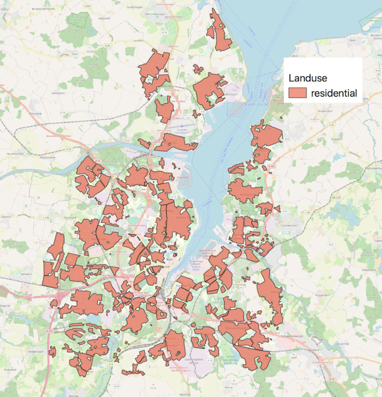
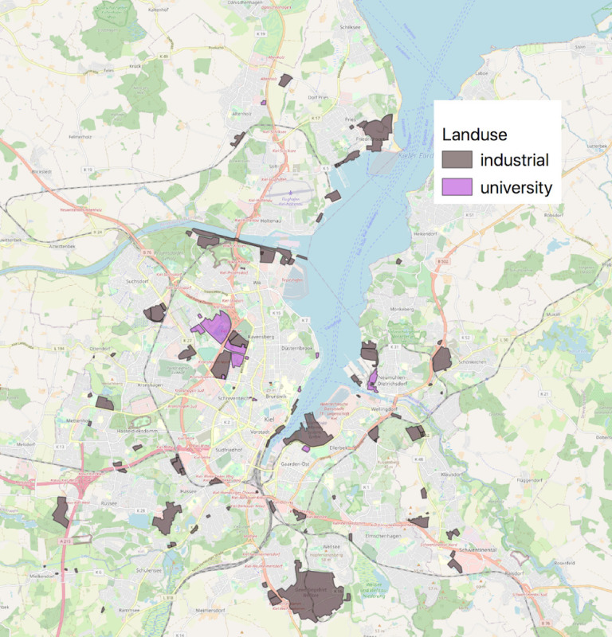

## Introduction

In this article, I'll be presenting a plan to use a combination of data sources and web APIs to answer several questions about transportation modes in the of city Kiel, Germany. For this study, I will be focusing on bicycling, driving and public transit (mostly buses in Kiel), and these are the questions I would like to answer:

- What is the average **duration** of travel for each transportation mode?
- What is the average **distance** traveled for each transportation mode?

### What is a trip?

A trip is quite easy to define in geographical terms: moving from one point the other (point A to point B). But most people don't usually decide to travel unless there's a specific reason (let's just pretend joy rides and walk-abouts don't exist for the time being). This means that we typically have goals and points of interest (POI) we want to visit, and when we do we pick a mode of transportation, this choice correlates to our preferences and abilities (both economic and physical).

For this study, I want to focus on two different types of trips: trips to universities and to work. All the of these trips to and from universities and work will be hypothetical and not involve real people. Instead they will be the result of random selecting geographically distributed points from across the city. By doing this, I will be able generate thousands of possible scenarios and then aggregating the results to look for statistical trends and differences.

In order to do this, I will rely on the usage of web APIs (Google Maps, Bing Maps, etc.) to provide the routes themselves as well as information about the duration and the distance. These services are usually pretty accurate and even take traffic patterns in to account for certain modes, so I think this should provide a pretty accurate portrayal of real travel times.

### Modes of Transport

Although there exist many different forms of transportation, the ones I will be focusing on for this study will be the following:

- Bicycle
- Automobile
- Public Transit

I decided to pick these forms of transport because they are three most dominant forms (aside from walking). Most importantly, the length of travel times and distances can easily be calculated with available web APIs.

Ultimately, I hope that the first phase of the study could then lead to a deeper dive in examining each of the aforementioned transportation modes. This could include an analysis of accessibility and equity issues among others.

## Methods

In the next section, I want to discuss some more concrete aspects of the study and outline exactly how I plan to carry it out. I'll be discussing the following:

- How do I collect residential addresses?
- What will my points of interest be?
- How will I determine my routes?
- What routing solutions are there? Which will I use?

### How do I define my residential study areas?

Open Street Map (OSM) is the Wikipedia of geographical data, and this data is frequently updated and made available for download. Included in this geographical database are polygons with details such as "landuse". Included among the landuse types are "residential" areas which is precisely what I need for this study. *Figure 1* shows these residential areas:

  <a href="./img/kiel_res_areas.jpg">
    <picture loading="lazy">
      <source srcset="img/kiel_res_areas.webp 800w" type="image/webp" />
      <source srcset="img/kiel_res_areas.jpg 800w" type="image/jpeg" />
      
    </picture>
  </a>

  
    <b>Figure 1</b> <i>Residential Areas in Kiel defined by OSM</i> 
    (Open Street Map <a href="https://www.openstreetmap.org/">https://www.openstreetmap.org/</a>)
    
  

### What will my points of interest be?

The POIs will basically be places where people regularly commute to (under normal, non-corona circumstances). For this study, I will be selecting universities and places where people typically work. The prior is really straightforward to define but the latter is little trickier.

In order to solve this problem, I have again turned to the OSM data to see if their classifications could offer any assitance. Also included under the "landuse" label is the category "industrial". This category includes plenty of places I personally know to be employment hubs such as "Wissenschaftspark" and "Gewerbegebeite Grasweg" both located directly near Kiel University. These areas are shown in *figure 2* below.

  <a href="img/kiel_city_areas.jpg">
    <picture>
      <source srcset="img/kiel_city_areas.webp 800w" type="image/webp" />
      <source srcset="img/kiel_city_areas.jpg 800w" type="image/jpeg" />
      
    </picture>
  </a>

  
    <b>Figure 2</b> <i>Universities and industrial areas in Kiel defined by OSM</i> 
    (Open Street Map <a href="https://www.openstreetmap.org/">https://www.openstreetmap.org/</a>)
    
  

### How will I determine my routes?

In order to determine my routes, I will intially determine the polygon I want to use shown in *figure 2*. These will be bigger industry areas and universities. The goal will be to end up with about 6 of these polygons.

After that, I will select a point at random for each polygon within each of those six (e.g. one point at Kiel University, one point at Altstadt, etc.). These points will serve as the POIs for the remainder of the study. Once I have those determined, I can begin randomly sampling points within residential neighborhoods throughout the city of Kiel and use this to create point pairs. With those point pairs in hand, I should be ready to submit them to a web API that can give me the best directions for this route while also providing information about distance and duration of the trip. This will be repeated three times for each transportation mode.

### What routing solutions are there? Which will I use?

This was a fairly straightforward decision: Google Directions API. The API is relatively easy to setup and feature rich. Supporting all three transportation modes I wanted (others I compared only supported bicycle and driving). This is a paid service, but users are granted a montly quota of free requests (one direction route = one request). Free of charge I will be able to make about 40,000 requests per month. Beyond that prices are still pretty reasonable ($5 per 1,000 requests).

## Concluding thoughts

This should be relateively easy to carry out study which could reveal some previously unknown details about transportation modes in the city of Kiel (or further affirm current knowledge). If all goes well, I hope to have a lot of interesting data to present at the end, and the findings here could lead to a jumping off point for another, more in depth analysis of mobility patterns in Kiel. Furthermore, this method could be adapted and scaled up for use in other cities (it would be very interesting to compare Kiel with another similarly sized city in Germany or even the USA).

I am already planning on writing a follow up to this article with all the nitty-gritty details of exactly how to put the various data management and programming aspects of this together, and there will definitely be a follow up with my findings. Stay tuned.
