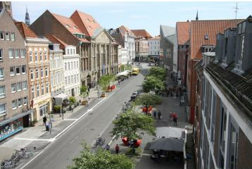
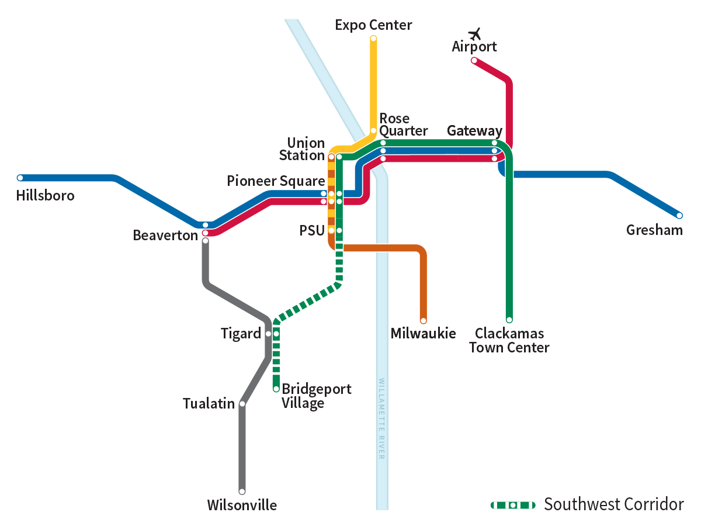

<h2 id="introduction">Introduction</h2>

Starting in the early 19th century, throughout the western world, a series developments in mobility would begin to unfold that would come to define our modern relationship with transportation. This development is namely the extraction of raw resources in order to gain ever faster and efficient transportation means. Coal was one of the first resources extracted to this end, and this material became the driver of the industrial revolution, thereby ushering in the era of steam powered locomotives. These new technologies and fuel sources, coupled with societies eager to encourage unrestrained capitalist accumulation, would allow for the amassing of fortunes previously unimaginable and still impressive by today’s standards.

As the exploration for new resources continued and the once prominent steam engines were deemed antiquated, a new resource and a new technology would surface: oil and the internal combustion engine (ICE). It was with this technology that society would usher in the era of Fordism which would fundamentally change society’s relationship with production and consumption of resources. Just like the steam engine before it, these technologies too would allow for a massive accumulation of wealth the likes of which the world had never seen before. Serving as primary collection pools for wealth, cities would undergo radical changes during this era. At every step in the process, the capital owning classes would make sure that city development was closely aligned with their financial interests. This continued push for automobile development often came at the expense of those living in cities given their negative externalities (e.g. pollution, noise, and accidents). Capital accumulation in this form was a formidable force to be reckoned with and left its mark on our cities for better or for worse.

But, in order to truly understand the development of the automobile, narratives of capital accumulation alone are not sufficient to paint the entire picture. Therefore, in order to truly understand the development of automobility, I feel it is important to also include the cultural factors which led to the automobile’s current hegemony. As is common throughout modern history, it is normally a combination of societal, environmental and economic phenomena that create the artifacts of our scrutiny. With this article, it is my goal to better understand the interplay between these phenomena and how this led to our modern automobile transport systems. Following this will be an examination of how the hubris of automobile development, which has often attempted to sweep its negative consequences under the rug, is currently being fought against in cities that wish to minimize its usage as much as possible.

<h2 id="railways-and-capital-accumulation">Railways and capital accumulation</h2>

Steam locomotive systems were first built out in Western Europe and North America throughout the 19th century. As these systems were developed and greater connectivity between cities was achieved, the very nature of transportation was being changed in a fundamental way, a change so fundamental that it was warping our notions of space and time itself. Additionally, this mode of transport was increasingly distancing the traveler from their surroundings (Hård and Jamison <a href="#ref-hard_hubris_2013">2013</a>). Earlier, during travel by foot or with a coach, it was much easier to feel as if one were part of the landscape. Travel was done at a much slower pace and one had ample opportunity for stopping. With the advent of travel by steam powered locomotives, one was quite literally isolated in a coach, less able to observe the details of their surroundings as they zoomed past the landscape.

It can easily be said that the locomotive was one of the key enabling technologies of the industrial revolution, but was there also a key enabling mentality to go along with it? According to Weber (<a href="#ref-weber_protestant_1905">1905</a>) there was and he called this the “Spirit of Capitalism”. Weber (<a href="#ref-weber_protestant_1905">1905</a>) writes that previous religious traditions (mainly Catholicism) had helped to quell potential urges to acquire wealth. It was only with the rise of Protestantism and the “protestant work ethic” that societies were slowly conditioned with the concept of earning more than one could actually consume. Initially, this devotion to ones work was a sign of faith and closely linked with asceticism, but eventually these religious overtones eroded away until we were left with what we have today: acquisition for acquisition’s sake alone.

This spirit was especially evident during the peak of railway development with great acquirers of wealth such as Andrew Carnegie and John D. Rockefeller. In the United States these men would epitomize what later became know as the “American Dream”, and they exhibited that hard work, dedication, and frugality could help overcome most obstacles in life. Wealth generation, as a means of securing ones lot in life, became an increasingly important discourse during this era in the western world. This fundamental belief in what society ought to be would lay the groundwork for further developments in industrial, mechanized societies that would repeatedly put material wealth above all other priorities. As we will cover later, Marxist theories do a great deal in examining symptoms of such materialist driven societies, but it this “Spirit of Capitalism” narrative and others like it that help us see the true underlying causes of unabated wealth acquisition.

<h2 id="the-age-of-the-automobile">The age of the automobile</h2>

By the time railway systems were well established, automobile development began to appear in Europe and the United States. The first automobiles were initially developed as replacements for horse drawn carriages and seen largely as luxury devices (Newman and Kenworthy <a href="#ref-newman_end_2015">2015</a>). They were not accessible to most people and the public largely saw them as a nuisance because of the smoke and noise they produced, but for the people that could afford them, it helped them discover a relatively novel experience: personal autonomy. The importance of personal autonomy within an urban landscape first gained traction with the widespread adoption of the bicycle in the latter half of the 19th century. The freedom to go wherever one wants and to do whatever one wants were beginning to merge with greater narratives of what it meant to live in a free and liberal society. This is something that Hård and Jamison (<a href="#ref-hard_hubris_2013">2013</a>) describe well:

<blockquote>

In a very concrete way, freedom was being reinterpreted, from a primarily political, social, and economic concept into a notion expressing individual mobility and personal autonomy. (p. 184)

</blockquote>

What truly let this discourse explode in popularity and gain widespread adoption in western societies was the advent of Fordist production techniques. Fordism, so named after its primary instigator the Ford Motor Company, was a system of mass production which simultaneously enabled mass consumption (Jonas, McCann, and Thomas <a href="#ref-jonas_urban_2015">2015</a>). For the first time, workers in factories could actually afford to buy the big ticket items that they were producing, and it was this system that helped push capital accumulation to all time highs. This was great news for the types of companies involved in the automobile trade, which included oil producers, rubber and tire producers and the automobile producers themselves. As these companies grew larger and larger, they cemented their influence on urban development in many western countries. Especially in the United States, where the automobile was seen as the standard mode of transportation for which there were rarely suitable replacements.

There were many factors which led countries like the United States, Australia and to a lesser extent western European nations to developing this dependency on automobiles. In the case of United States and Australia, it can be argued that an ample supply of space allowed urban sprawl to grow unchecked, impacting the urban environment in such a way that necessitated the use of automobiles. But, as Urry (<a href="#ref-urry_societies_2013">2013</a>) points out in his book, “Societies beyond oil: oil dregs and social futures”, none of this would have been possible without the discovery of massive oil reserves in the early 20th century. Cheap oil paired with Fordist production techniques were the perfect combination to allow the type of urban expansion that autos enabled. In retrospect, it appears that the discovery of oil was likely the most significant contributor to our modern transportation systems.

Increasingly, this cheap oil was creating entirely new lifestyles, what Urry (<a href="#ref-urry_societies_2013">2013</a>) refers to as “lives lived beyond the neighborhood”. This is contrasted with what he terms as more traditional, “neighborhood lives”. “Neighborhood lives” were much more common in cities before the middle of the 20th century and typically meant that most people could easily walk to reach their destinations. With a push towards “living beyond the neighborhood” people were inherently compelled to consume more in order to achieve the same standard of living. As the urban form expanded and grew, so did the energy consumption necessary to maintain it. Thus, movement itself became an integral factor to the lives of people living in such configurations, which still persists to this day.

Pushing these lifestyles was an underlying shift in economic configurations to greater and greater levels of capital accumulation. One tool at our disposal for interpreting these changes is the ideological lens of Marxism. According to Harvey (<a href="#ref-bridge_urban_2010">2010</a>), the technical disruption of automobiles, which helped undo the previous systems of railroad transportation, was all part of the predictable ebbs and flows of capital accumulation within urban environments. This must necessarily happen as capital investments depreciate and investors search for investment vehicles to park their funds in. But, at the same time, investments in the physical environment also impede how quickly new capital can be invested as we must wait for long cycles of depreciation (30 years or more) before we can invest again. This is something Harvey (<a href="#ref-bridge_urban_2010">2010</a>) sums up well:

<blockquote>

Under capitalism there is, then, a perpetual struggle in which capital builds a physical landscape appropriate to its own condition at a particular moment in time, only to have to destroy it, usually in the course of a crisis, at a subsequent point in time (p. 120)

</blockquote>

The effects of building and dismantling built capital within urban environments can be seen with an example from the United States. In the late 19th and early 20th centuries, where many cities still had viable and popular street cars lines, several companies in the automobile industry, including General Motors, actively collaborated to successfully dismantle many street car lines across the country (Urry <a href="#ref-urry_societies_2013">2013</a>). Once this built capital was removed, it then helped clear the way for a new wave of capital investment, which favored the same automobile companies. It can be argued that much of this development was very shortsighted and profit driven as the consequences of air pollution, displacement and deaths from accidents were ignored. As time went on though, these negative consequences began to slowly pile up.

Flash forward to the present day and cities are still dealing with the myriad side effects that have resulted from the unabated development of automobile based transportation. As it currently stands, there are over a billion automobiles on roads worldwide (Statista <a href="#ref-statista_number_2017">2017</a>). These automobiles cause all kinds of problems in our cities including thousands and thousands of premature deaths from accidents; negative health side effects from their pollution; and the millions of tons of CO2 they emit into the atmosphere every year. Today, many cities are calling for a new type of relationship with automobiles. The type of relationship Jacobs (<a href="#ref-jacobs_death_1961">1961</a>) first called for over a half century ago. This is the type of relationship that prioritizes people first and automobiles second. We will be spending the remainder of the article looking at such efforts currently underway in Lübeck, Germany and Portland, Oregon in the United States.

<h2 id="pedestrianization">Pedestrianization</h2>

One policy that has been in use since the post-war era in Western Europe is what Monheim (<a href="#ref-monheim_pedestrianisation_2003">2003</a>) refers to as “pedestrianization”. The goal of such a method is not necessarily the reduction of car use but, “the reduction of conflicts caused by cars in the city centre” (Monheim <a href="#ref-monheim_pedestrianisation_2003">2003</a>, 177). Monheim (<a href="#ref-monheim_pedestrianisation_2003">2003</a>) also compares this process, which made inner cities more pedestrian and business friendly, as being somewhat similar to why shopping malls were developed in the United States. This was a time when city development catered almost exclusively to automobiles, but city planners realized people still needed areas where they could gather. In the United States, these were largely malls in suburban areas but in Europe these were pedestrianized areas of the inner city. Today, one can see the manifestations of such policies in German cities such as Stuttgart, Heidelberg and Kiel where there are large pedestrian only promenades in the city center. These spaces primarily serve as shopping districts and event venues.

Beginning in the late 80s, the city of Lübeck in Germany began experimenting with pedestrianization policies that aimed at creating a more enjoyable atmosphere for its residents and wished to expand it to a larger area than just a single shopping district. The policies initially included restricting the time automobiles were permitted to enter the city (10am - 6pm) and was only in effect on specific “shopping weekends” (Topp and Pharoah <a href="#ref-topp_car-free_1994">1994</a>). Exempt from the exclusion were local residents as well delivery and emergency vehicles (Topp and Pharoah <a href="#ref-topp_car-free_1994">1994</a>). Lübeck would later go on to implement these policies more forcefully by requiring the same rules except during the entire week. Whether or not these policies were actually successful remains debated, with some referring to the roll-out of these rules as a fiasco for small businesses (“Verkehrsberuhigung: Neuer Plan Für Lübecker Altstadt – Das Wird Jetzt Ein Jahr Getestet” <a href="#ref-noauthor_verkehrsberuhigung_2019">2019</a>). All of this may have helped lead to a dampening of the rules originally intended to prioritize pedestrian traffic in the city center.

   
  
  <b>Figure 1</b> <i>Project Beckergrube</i> (“Projekt Beckergrube – Lübeck:ÜberMorgen” <a href="#ref-noauthor_projekt_2021">2021</a>)

Today in Lübeck, there is still dissatisfaction with the amount of automobiles in the inner city. This is evidenced by a recent forward-looking report by the city which involved many citizens voicing their opinions regarding mobility (Lindfeld <a href="#ref-lindfeld_rahmenplan_2019">2019</a>). Out of the report came recommendations for how to further reduce conflicts between pedestrians and automobiles, including removing certain through traffic routes and the removal of parking places. A project that came out of these recommendations is the ongoing “Project Beckergrube” (“Projekt Beckergrube – Lübeck:ÜberMorgen” <a href="#ref-noauthor_projekt_2021">2021</a>). Beckergrube is a street in the inner city of Lübeck, and the project is specifically aimed at making this a more pedestrian friendly zone. They were able to accomplish this by removing parking places, which created new space for urban gardens, trees and other types of vegetation (see figure one). The recent history of Lübeck shows us that fighting against the path dependencies created by automobiles can be a long and strenuous process, but it can be overcome one street at a time.

<h2 id="urban-rail">Urban rail</h2>

Another trend among cities wishing to reduce their dependence on the automobile is the development of urban rail systems. Urban rail includes things such as subways, light rail, tram systems and street cars, and it has been shown that when these transportation means comprise more than 50% of a city’s total ridership there are significantly higher rates of use of the total system (Kenworthy <a href="#ref-kenworthy_international_2008">2008</a>). Although some argue that well designed bus lines can offer comparable benefits to urban rail, they simply cannot match the carrying capacity urban rail offers. As an example, the transit authority of New York recently proposed temporarily closing the popular “L” subway line to perform desperately needed repairs. This was cause for much distress amongst it riders because this line was heavily trafficked. In one analysis, researchers concluded it would take nearly 1,154 buses per day, or one fully loaded bus stopping every minute to carry the amount of traffic this single subway line carried (CARTO <a href="#ref-carto_l_2016">2016</a>). The threat of having these vital lines removed even for a couple of months show how important they are to the movement of people in cities.

In the United States, New York is a rare example of how a single city has successfully maintained a strong urban rail presence. The overwhelming trend in the United States throughout the last century was not and typically included an early rise of electric powered streetcar systems which eventually were dismantled as the automobile grew in popularity. One such system was in Portland, Oregon. At its peak, it covered an extensive part of the city, and many neighborhoods across the city can directly attribute their growth to it (Thompson <a href="#ref-thompson_portland_2018">2018</a>). This system only lasted until the 50s when it was superseded by the automobile and the aforementioned campaigns against streetcars by the automobile industry. Beginning in the late 80s Portland would reawaken its interest in intra-city ubran rail. This was a light rail system called the MAX (Metropolitan Area Express) and was one of the first of its kind in the United States to use federal funding initially intended for highway construction (TriMet <a href="#ref-trimet_eastside_nodate">n.d.</a><a href="#ref-trimet_eastside_nodate">a</a>). The build out of this system and its ridership has been steadily increasing ever since its launch and now encompasses five lines and 97 kilometers of track (see figure two).

   
  
  <b>Figure 2</b> <i>Portland’s current light rail system, with proposed “Southwest Corridor”</i> (TriMet <a href="#ref-trimet_portland_nodate">n.d.</a><a href="#ref-trimet_portland_nodate">b</a>)

But recently, this growth took a hit. In 2020, voters across the Portland Metropolitan area went to the polls to decide the future of the “Get Moving 2020” ballot measure. Among other things, this measure would have provided funding for Trimet’s (Portland’s transit authority) “Southwest Corridor Light Rail Project” (TriMet <a href="#ref-trimet_trimets_2020">2020</a>). This project would have extended an existing light rail line while also providing crucial traffic congestion relief along one of Portland’s most traveled freeways. The measure would have included a 0.75% increase on payroll taxes and was defeated with 58% voting no and 42% vote yes (“Portland Metro, Oregon, Measure 26-218, Infrastructure and Transportation Payroll Tax (November 2020)” <a href="#ref-noauthor_portland_nodate">n.d.</a>). Trimet’s official press brief stated:

<blockquote>

While there was broad and enthusiastic community support for the transportation improvements in the package, the funding levels needed to advance those projects on an aggressive timeline appear to be more than the current economic climate could support. (TriMet <a href="#ref-trimet_trimets_2020">2020</a>)

</blockquote>
<h2 id="conclusion">Conclusion</h2>

Trimet will and should continue to find other forms of funding because a project like this ultimately is the right choice for the Portland Metro Area. Without the continued growth of these transportation networks, car dependency and all its related problems will only persist. We can see parallels between the failure of this ballot measure and the struggles that Lübeck saw with its initial roll-out of car reduction strategies. In both cities, the process of capital accumulation cemented path dependencies that made untold amounts of wealth for the oil and automotive industries. Underlying all of this was the aforementioned spirit of capitalism which enables us to pursue our own forms of wealth accumulation often at the expensive of our cities and the environment. Encouraging public transportation and discouraging personal automobile ownership are both policies that can help dismantle the system of acquisition for acquisition’s sake alone. Going forward, it will be interesting to see whether cities can successfully achieve this or whether we again end up with a system of transport primarily fueled by materialist accumulation like we have today.

<h2 id="references" class="unnumbered">References</h2>

  

  
CARTO. 2016. “The L Train Closure—What Data Can Tell Us.” <a href="https://carto.com/blog/looking-at-the-l/">https://carto.com/blog/looking-at-the-l/</a>.

  

  

  
Hård, Mikael, and Andrew Jamison. 2013. <em>Hubris and Hybrids : A Cultural History of Technology and Science</em>. Routledge. <a href="https://doi.org/10.4324/9781315024400">https://doi.org/10.4324/9781315024400</a>.

  

  

  
Harvey, David. 2010. “The Urban Process Under Capitalism: A Framework for Analysis.” In <em>The Blackwell City Reader</em>, edited by Gary Bridge and Sophie Watson, 32–39. John Wiley &amp; Sons.

  

  

  
Jacobs, Jane. 1961. <em>The Death and Life of Great American Cities</em>. Vintage Books ed. New York: Vintage Books.

  

  

  
Jonas, Andrew EG, Eugene McCann, and Mary Thomas. 2015. <em>Urban Geography: A Critical Introduction</em>. John Wiley &amp; Sons.

  

  

  
Kenworthy, Jeffery. 2008. “An International Review of the Significance of Rail in Developing More Sustainable Urban Transport Systems in Higher Income Cities.” <em>World Transport Policy and Practice</em> 14 (2): 21–37. <a href="https://espace.curtin.edu.au/bitstream/handle/20.500.11937/47741/160302_160302.pdf">https://espace.curtin.edu.au/bitstream/handle/20.500.11937/47741/160302_160302.pdf</a>.

  

  

  
Lindfeld, Julia, ed. 2019. “Rahmenplan Innenstadt Mit Mobilitätskonzept.” 115. Hansestadt Lübeck. <a href="https://uebermorgen.luebeck.de/files/RP_Innenstadt_Broschuere_Webseite.pdf">https://uebermorgen.luebeck.de/files/RP_Innenstadt_Broschuere_Webseite.pdf</a>.

  

  

  
Monheim, Rolf. 2003. “Pedestrianisation and "Car-Free" City Centres as Strategies to Secure Liveability Within the City Centre.” In <em>A City for Pedestrians: Policy-Making and Implementation</em>, edited by Dominique Fleury, 177–91. European Commision. <a href="https://op.europa.eu/de/publication-detail/-/publication/a2a6ff8e-de38-4e35-9ca3-6e6127469452">https://op.europa.eu/de/publication-detail/-/publication/a2a6ff8e-de38-4e35-9ca3-6e6127469452</a>.

  

  

  
Newman, Peter, and Jeffrey Kenworthy. 2015. <em>The End of Automobile Dependence How Cities Are Moving Beyond Car-Based Planning</em>. Island Press. <a href="https://doi.org/10.5822/978-1-61091-613-4">https://doi.org/10.5822/978-1-61091-613-4</a>.

  

  

  
“Portland Metro, Oregon, Measure 26-218, Infrastructure and Transportation Payroll Tax (November 2020).” n.d. <em>Ballotpedia</em>. Accessed March 24, 2021. <a href="https://ballotpedia.org/Portland_Metro,_Oregon,_Measure_26-218,_Infrastructure_and_Transportation_Payroll_Tax_(November_2020)">https://ballotpedia.org/Portland_Metro,_Oregon,_Measure_26-218,_Infrastructure_and_Transportation_Payroll_Tax_(November_2020)</a>.

  

  

  
“Projekt Beckergrube – Lübeck:ÜberMorgen.” 2021. Government. <em>Hänsestadt Lübeck: Übermorgen</em>. <a href="https://uebermorgen.luebeck.de/projekte/innenstadt/umsetzung/index.html">https://uebermorgen.luebeck.de/projekte/innenstadt/umsetzung/index.html</a>.

  

  

  
Statista. 2017. “Number of Vehicles in Use Worldwide 2015.” <em>Statista</em>. <a href="https://www.statista.com/statistics/281134/number-of-vehicles-in-use-worldwide/">https://www.statista.com/statistics/281134/number-of-vehicles-in-use-worldwide/</a>.

  

  

  
Thompson, Richard. 2018. “Portland Streetcar System.” Encyclopedia. <em>Oregon Encyclopedia</em>. <a href="https://www.oregonencyclopedia.org/articles/portland_streetcar_system/#.YFs7QP4xmV4">https://www.oregonencyclopedia.org/articles/portland_streetcar_system/#.YFs7QP4xmV4</a>.

  

  

  
Topp, Hartmut, and Tim Pharoah. 1994. “Car-Free City Centres.” <em>Transportation</em> 21 (3): 231–47. <a href="https://doi.org/10.1007/BF01099212">https://doi.org/10.1007/BF01099212</a>.

  

  

  
TriMet. 2020. “TriMet’s Statement on the 2020 Funding Measure Vote.” <em>TriMet News</em>. <a href="http://news.trimet.org/2020/11/trimets-statement-on-the-2020-funding-measure-vote/">http://news.trimet.org/2020/11/trimets-statement-on-the-2020-funding-measure-vote/</a>.

  

  

  
TriMet. n.d.a. “Eastside MAX Blue Line Project.” Accessed March 24, 2021. <a href="https://trimet.org/history/eastblueline.htm">https://trimet.org/history/eastblueline.htm</a>.

  

  

  
———. n.d.b. “Portland to Tualatin in 30 Minutes: Designing the Next MAX Line.” Accessed March 29, 2021. <a href="https://trimet.org/swcorridor/index.htm">https://trimet.org/swcorridor/index.htm</a>.

  

  

  
Urry, John. 2013. <em>Societies Beyond Oil: Oil Dregs and Social Futures</em>. London; New York: Zed Books. <a href="http://site.ebrary.com/id/10642039">http://site.ebrary.com/id/10642039</a>.

  

  

  
“Verkehrsberuhigung: Neuer Plan Für Lübecker Altstadt – Das Wird Jetzt Ein Jahr Getestet.” 2019. <em>MOPO.de</em>. <a href="https://www.mopo.de/im-norden/luebeck/verkehrsberuhigung-neuer-plan-fuer-luebecker-altstadt---das-wird-jetzt-ein-jahr-getestet-33671920">https://www.mopo.de/im-norden/luebeck/verkehrsberuhigung-neuer-plan-fuer-luebecker-altstadt---das-wird-jetzt-ein-jahr-getestet-33671920</a>.

  

  

  
Weber, Max. 1905. <em>The Protestant Ethic and the Spirit of Capitalism</em>. Routledge Classics. London ; New York: Routledge.

  

