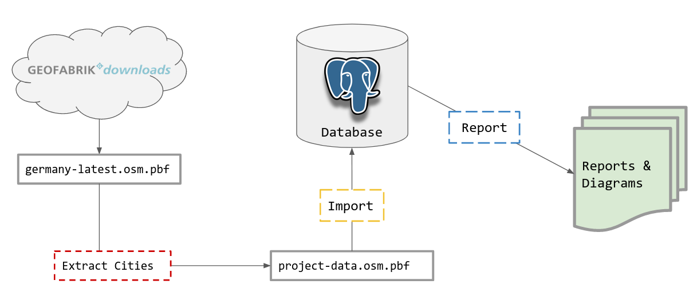

*This is meant to be a companion post to the talk I gave at PyConDE 2022. This post will still make sense even if you have not watched the talk, but I highly recommend checking it out.* 😉

*Link to the talk coming soon!*

<!--a href="https://travishathaway.com" class="external-service">
  <span>Click here to watch the talk</span>
  <i class="fa-brands fa-youtube fa-xl" style="color: var(--darkgray)"></i>
</a-->

<hr />

## Background

In 2021, I set off to write my master thesis in the field of urban analytics using the city of Kiel in Northern Germany as my study area. I wanted to find out how accessible the city was by foot and in turn use this data as a justification for car-reduction measures ([read more about this project here](https://altmo.thath.net/)). To create this accessibility assessment, I was going to need data about where people lived and where all the common amenities were in the city.

With its global dataset, the [OpenStreetMap](https://openstreetmap.org) project provided me with a lot of good data to complete this analysis. The project itself has millions of contributors and is constantly growing. Accuracy for this data set varies between countries, but for Germany, where I was going to base my study, the data quality is high with plenty of detailed information available.

In order to sift through this data and come up with a meaningful analysis, I was also going to need a way to organize this project. This is where PostgreSQL and Python came into play. From the outset, I decided that PostgreSQL with its PostGIS extension was going to be the "data warehouse" for the project. For organizing the running of queries and generating reports, I would use Python to glue everything together.

I learned quite a bit from this process and now want to report everything I learned in one big mega-tutorial.

Here's what we'll cover:

- [OSM data overview (including data types of tags)](#osm-overview)
- [OSM data in PostgreSQL/PostGIS](#postgis-overview)
- [How do we import this data?](#osm-data-import)
- [Other tools for processing OSM data](#osm-other-tools)
- [Python example project](#python-example-project)

*Want to just see the code? The link below will send you to an example project I created utilizing everything I talk about in this article:*

<a href="https://github.com/travishathaway/osmprj" class="external-service">
  <span>Check it out on GitHub</span>
  <i class="fa-brands fa-github-square fa-xl" style="color: #24292f"></i>
</a>

<hr />


## <a id="osm-overview"></a>OSM data overview

Data in OSM is organized in a hierarchical manner, and there are three basic types of data: nodes, ways and relations. Nodes lie at the bottom of the hierarchy and can be used to represent things which occupy a single point in space. These are often things such benches, waste baskets or bus stops.

<div style="text-align: center; margin-top: 2em; margin-bottom: 2em">
  <div class="osm-data-types">
    <div>
      <a href="https://wiki.openstreetmap.org/wiki/Node" title="OSM Wiki Node">
        
      </a>
      <div><strong>Node</strong></div>
    </div>
    <div>
      <a href="https://wiki.openstreetmap.org/wiki/Way#Open_way_.28Open_polyline.29" title="OSM Wiki Open Way">
        
      </a>
      <div><strong>Way:</strong> Open</div>
    </div>
    <div>
      <a href="https://wiki.openstreetmap.org/wiki/Way#Closed_way_.28Closed_polyline.29" title="OSM Wiki Closed Way">
        
      </a>
      <div><strong>Way:</strong> Closed</div>
    </div>
    <div>
      <a href="https://wiki.openstreetmap.org/wiki/Way#Area" title="OSM Wiki Area">
        
      </a>
      <div><strong>Way:</strong> Area</div>
    </div>
    <div>
      <a href="https://wiki.openstreetmap.org/wiki/Relation" title="OSM Wiki Relation">
        
      </a>
      <div><strong>Relation</strong></div>
    </div>
  </div>
  <span style="font-size: 0.8em">
    <b>Figure 1</b> <i>All of the OSM data types you'll run across (click the icons for more documentation on the OSM Wiki)</i>
  </span>
</div>

As we head higher up this hierarchy, we meet the next data type: ways. Ways are connections of two or more nodes. When they do not close in on themselves, we call these "open ways" (i.e. lines), and when they do close in on themselves, we call them closed ways (circles) or areas (polygons). Examples of these data types include things like roads, streams (both open ways), roundabouts (closed way), or political boundaries (areas).

Once we reach the top of the hierarchy we find relations. Relations provide a way to arbitrarily nest and group ways and nodes together. For example, a bus route may include a collection of open ways representing streets. This data type in particular allows us to describe the sometimes complex relationships that our physical world has. Also falling into this category are lakes with islands and buildings with central courtyards (i.e. donut shaped things).

<hr />

## <a id="osm-tags"></a>Tags in OSM

The tagging system is incredibly important to OSM as this is what allows it to neatly categorize all of its wonderful data. At heart, it is a simple key, value store, and the system itself is very flexible as it allows contributors to create any key, value pairs they wish. But, at the same time, the community does maintain informal standards for appropriate tag values, which makes the system much more reliable and predictable.

One very common tag in OSM is [amenity](https://wiki.openstreetmap.org/wiki/Key:amenity). This includes various attractions or places you generally might enjoy going to. Here are some example values:

- Cinema
- Pub
- Restaurant
- Library

Other examples include [landuse](https://wiki.openstreetmap.org/wiki/Key:landuse) which has values such as commercial, residential, farmland and [building](https://wiki.openstreetmap.org/wiki/Key:building) with values such as apartments, house and hotel.

In order to see the full variety of tags already in use, [head to the OSM Wiki's tags page](https://wiki.openstreetmap.org/wiki/Map_features). There is also [Taginfo](https://taginfo.openstreetmap.org/) for getting exact counts on how many features have a particular tag.

<hr />


## <a id="postgis-overview"></a>OSM data in PostgreSQL/PostGIS

PostGIS represents its data types in much the same way as OSM, except for the fact that it uses a slightly different naming scheme. In PostGIS nodes are represented use the `Point` geometry type, while ways can be either represented as `Linestring` or `Polygon`. To represent relations, PostGIS has a variety of `Multi*` data types (e.g. `MultiPolygon`). All of these data types inherit from a root `Geometry` type, which can be used as generic type to store any geometry type (see *figure 2* for more details).

<div style="text-align: center; margin-top: 2em; margin-bottom: 2em">
  <a href="./img/postgis_data_types.png" title="PostGIS data types">
    <br />
  </a>
  <span style="font-size: 0.8em">
    <b>Figure 2</b> <i>Data types in PostGIS</i>
  </span>
</div>

### Geospatial queries

In this section, I'm going to provide a very quick introduction to writing geospatial queries in PostgreSQL. Let's assume we have the following table schema installed in our database:

```sql
-- Be sure to enable the postgis extension if you haven't done so already!
CREATE EXTENSION postgis;

CREATE TABLE bus_stops (
  bus_stop_id SERIAL PRIMARY KEY,
  geom Geometry(Point)
);

CREATE TABLE cities (
  city_id SERIAL PRIMARY KEY,
  name VARCHAR(150),
  geom Geometry(Polygon)
);
```

We'll fill it with some sample data. The sample data here are just random points and shapes on a cartesian plane. Most of the time, your points will correspond to whatever projection coordinate system you are using (e.g. `EPSG: 4326` in degrees or `EPSG 3857` in meters).

```sql
-- Create five bus stops
INSERT INTO bus_stops (geom) VALUES ('POINT(1 2)');
INSERT INTO bus_stops (geom) VALUES ('POINT(1 3)');
INSERT INTO bus_stops (geom) VALUES ('POINT(2 3)');
INSERT INTO bus_stops (geom) VALUES ('POINT(7 10)');
INSERT INTO bus_stops (geom) VALUES ('POINT(10 10)');

-- Create one city boundary (shaped like a square)
INSERT INTO cities (geom) VALUES ('POLYGON((0 0, 5 0, 5 5, 0 5, 0 0))');
```

How would we find out how many bus stops each city has?

To answer this question, we need to use one of the special functions that the PostGIS extension has made available to us. It's called `ST_Contains` and accepts two geometries ("a" and "b"). If geometry "b" is located inside geometry "a" it will return true; otherwise, it will return false. Because this function returns a true/false value, we can use it in a `JOIN` operation. Using these functions in this way is referred to as a "spatial join".

Here's an example solution to the question above:

```sql
-- 
SELECT
  c.name,
  count(*) as count
FROM
  bus_stops b
JOIN 
  cities c
ON
  ST_Contains(c.geom, b.geom)
GROUP BY
  c.name;
```

Which results in the following output:

```bash
    name     | count 
-------------+-------
 Squareville |     3
```

*That was a very quick introduction to writing geospatial queries in PostgreSQL. For a full introduction, I highly encourage reading the "[Introduction to PostGIS](https://postgis.net/workshops/postgis-intro/)" article at [postgis.net](https://postgis.net)*

<hr />

## <a id="osm-data-import"></a>How do we import this data?

Importing this data into PostgreSQL is made possible through a variety of tools ([check them all out here](https://wiki.openstreetmap.org/wiki/PostgreSQL)), but in this article, I am going to introduce you to `osm2pgsql`. This is a tool capable of importing OSM data in a very generic way, but it also has options which allow you to highly customize the import.

For example, it is possible to import OSM data using custom Lua scripts. Below is an example of such a script:

```lua
-- Holds all the database tables you may want to define
local tables = {}

-- Tell the import script what the table should look like
-- and what columns to include.
tables.amenity_points = osm2pgsql.define_node_table('amenity_points', {
    { column = 'type', type = 'text' },
    { column = 'tags', type = 'jsonb' },
    { column = 'geom', type = 'geometry', projection = 3857 },
})

-- This function gets called during the import process and runs
-- for each node. There are others for processing `ways` and
-- `relations`.
function osm2pgsql.process_node(object)
    if object.tags.amenity or object.tags.shop then
        tables.amenity_points:add_row({
          type = object.tags.amenity,
          tags = object.tags,
          geom = { create = 'point' }
        })
    end
end
```

If you want to see some more good examples of using Lua scripts to import OSM data, check out the following links:

- [PgOSM Flex](https://github.com/rustprooflabs/pgosm-flex) 👈 *tons of great Lua examples, plus a base Docker image you can use.*
- [osm2pgsql.org's example page](https://osm2pgsql.org/examples/) 👈 *example use cases and detailed documentation on the Lua script format*

<hr />

## <a id="osm-other-tools"></a>Other tools for processing OSM data

Other than `osm2pgsql`, another great tool for working with OSM data is `osmium`. This CLI tool can be thought of as the swiss army knife for OSM data as it can perform diffs, extracts and filters among other things. Using this tool for extracts can be very useful when filtering large OSM datasets. The following example shows how we can use bounding boxes to extract a subset from a larger data file:

```bash
# Bounding box format: min_lon, min_lat, max_lon, max_lat

osmium extract \
  --bbox -123.3,45.1,-122.1,45.8 \
  --output portland-metro-area.osm.pbf \
  us-west-latest.osm.pbf
```

This command extracts all the data for the Greater Portland Metro Area in the U.S. Using extracts this way can be especially practical when the area you want data for spans state boundaries. The Greater Portland Metro Area actually extends into Washington, so an extract of either Oregon or Washington alone would not suffice. Instead, it's easier to download a larger area first (i.e. `us-west-latest`) and then perform an extract based on a bounding box.

On top of extracting, `osmium` can also provide a way to quickly filter OSM datasets by tag. The following example retrieves everything in the data set where the amenity tag is not null:

```bash
osmium tags-filter \
  --output portland-metro-amenities.osm.pbf \
  portland-metro-area.osm.pbf \
  amenity
```

For a full list of these commands, go check out the [osmium documentation](https://docs.osmcode.org/osmium/latest/).

<hr />

## <a id="python-example-project"></a>Python example project

We've covered just about everything you need to know concerning importing OSM data to your PostgreSQL database and getting it ready for analysis. But, how do we organize this analysis? And how do we make sure that it's as easy as possible to share our work with others when they want to modify it or extend it? In this section, I'm going to walk you through one way to do this with Python by creating a command line program similar to the ones used in the examples above.

But, before we start, let's give our project a purpose. Let's pretend that we have just won a contract with the *Trash Can Alliance of the Globe* (a trash can advocacy group, of course). They are interested in conducting research on trash cans in Germany and need to know the following:

- How many trash cans are located in the top 10 cities in Germany (by population)
- What's the trash can availability like in these cities?
- Which cities are the best and which are the worst?

Luckily, this a question that we can answer with the OSM data set. We can query everything with the tag `amenity = waste_basket` to find all the trash cans in Germany. Furthermore, we can use the administrative boundaries in OSM to count all the of the trash cans in a city. We'll compare these cities with each other by calculating a "Trash cans per square kilometer" metric.

### Implementation

Now the we have a game plan, we need to figure out how to implement it. Here's the general workflow we want:

<div style="text-align: center; margin-top: 2em; margin-bottom: 2em">
  <a href="./img/data-pipeline.png" title="Data pipeline chart">
    <br />
  </a>
  <span style="font-size: 0.8em">
    <b>Figure 1</b> <i>Data pipeline for our OSM data</i>
  </span>
</div>

We begin by downloading the data from [download.geofabrik.de](https://download.geofabrik.de) for the entirety of Germany (`germany-latest.osm.pbf`) and then extracting just the cities we care about. After this we have to import this into to PostgreSQL, while simultaneously organizing it into our preferred structure. Finally, we will need a way to generate reports and visualizations from this data.

To summarize, we have the following four operations we need to perform:

<div class="pipeline-stages">
  <div>
    <div class="number">1.</div>
    <code>Download</code>
  </div>
  <div class="pointer">👉</div>
  <div>
    <div class="number">2.</div>
    <code>Extract</code>
  </div>
  <div class="pointer">👉</div>
  <div>
    <div class="number">3.</div>
    <code>Import</code>
  </div>
  <div class="pointer">👉</div>
  <div>
    <div class="number">4.</div>
    <code>Report</code>
  </div>
</div>

<hr />

I'm now going to walk you through how I a created a command line interface (CLI) tool to manage this pipeline. The CLI tool is going to be named `osmprj` (short for "OSM Project Manager"), and it's going to function a lot like `git`. This tool will hold various sub-commands for the tasks we want it to complete.

<a href="https://github.com/travishathaway/osmprj" class="external-service">
  <span>Link to the full project on GitHub</span>
  <i class="fa-brands fa-github-square fa-xl" style="color: #24292f"></i>
</a>

### Download and extract

The first sub-command we'll create is called `prepare`. Just like it sounds, this command will "prepare" our data for import into our PostgreSQL database. It will actually combine the download and extract steps in our chart above into a single step. 

Here's an example of what using it looks like:

```bash
osmprj prepare \
  --config config.json \
  europe/germany \
  project-data.osm.pbf
```

What's being executed here?

- Retrieves OSM data from [GeoFabrik](https://download.geofabrik.de) using the "europe/germany" term (we cache this data too 😉)
- Extracts all the cities we specified in our `config.json` file.
- Merges all the separate extracts to a single file.

This a snippet from our `config.json` file:

```json
{
  "extracts": [
    {
      "output": "extracts/berlin.osm.pbf",
      "output_format": "pbf",
      "bbox": [
        13.094083496270972,
        52.33482927655171,
        13.766772766313322,
        52.67206633881316
      ]
    }
  ]
}
```

Under the hood, this CLI tool is actually making several calls to `osmium` via Python's `subprocess` module. It calls the commands `osmium extract` and `osmium merge`. On top of simplifying our command line workflow, doing this allows us to introduce new features like "extract caching" so we can speed up subsequent runs. This works very well for interactive use and development! Check out out the source code to see exactly how it's implemented.

### Import

Importing can be done with the `osm2pgsql` command now that we have our project data in a single file. Here, I'm using the Lua scripts provided by the PG OSM Flex project (https://github.com/rustprooflabs/pgosm-flex), which I have adapted for my own purposes.

```bash
osm2pgsql \
  --database germany_osm \
  --output flex \
  --style main.lua \
  project-data.osm.pbf
```

### Report

After the last step, we now have all of our data in PostgreSQL, and we are ready to begin querying it and making some reports. To do this, I have chosen a to create an aptly named sub-command called `report`. This sub-command will actually hold further sub-commands for the various report types we would like to generate.

Here are some examples:

```bash
TOP_CITIES="Berlin,Hamburg,München,Köln,Frankfurt am Main,Stuttgart,Düsseldorf,Leipzig,Dortmund,Essen"

osmprj report \
  --config config.json \
  amenity_city "$TOP_CITIES" waste_basket \
  --output-type chart \
  --output-file chart.html
```

Break of what's going on:

- `config.json` holds our database connection details (`pg_dsn`)
- `amenity_city` is the report we invoke
- `$TOP_CITIES` is a shell variable holding all the cities we need a report for
- `waste_basket` is the amenity type we want to report on
- `--output-type` and `--output-file` specify how we want to generate this report

The report itself will give us some information about the cities as well as the "amenity per square kilometer" statistic. This is what we'll use to compare the cities to each other.

Here the final result (using the [Plotly](https://plotly.com/) library in Python):

<div style="text-align: center; margin-top: 2em; margin-bottom: 2em">
  <a href="./img/report-results.png" title="Report results">
    <br />
  </a>
  <span style="font-size: 0.8em">
    <b>Figure 2</b> <i>Report results we'll deliver to Trash Can Alliance of the Globe!</i>
  </span>
</div>

The results show that Stuttgart and Munich are the clear winners! (at least in terms of trash cans). But, do these results actually reflect the truth on the ground? We need to investigate further to know for sure. Maybe Leipzig just doesn't have as much data on where their trash cans are. Any good researcher or journalist would keep digging to see why these differences exist and what they mean.

## Final thoughts

If you are interested in taking this analysis further, I recommend adding data about population density to the mix (e.g. [Global Human Settlement Layer](https://ghsl.jrc.ec.europa.eu/)) to get an even better measurement of "trash can accessibility". Additionally, at this point we could also make a point cluster map of each city to see which parts of the city have the most trash cans. Can you completely automate expanding the CLI tool I introduced so far? (most likely, there are lots of great mapping libraries out there for Python!)
