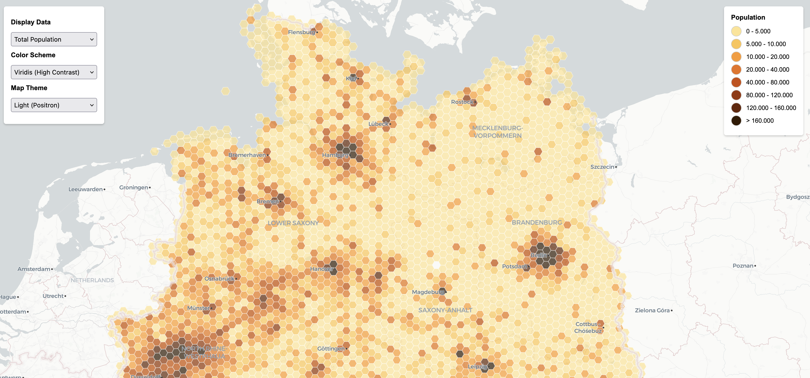
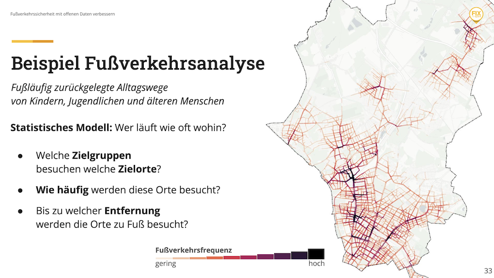
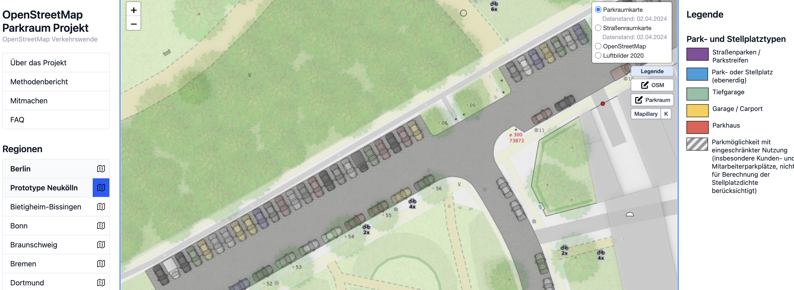

This was my first time at [FOSSGIS](https://www.fossgis-konferenz.de) and also my first time attending a conference entirely in German 🇩🇪. Having lived in Germany for over six years now, it was great to finally experience a conference in the native tongue of my chosen country of residence 🥲. To keep the post organized, I'll give my take on a few of my favorite talks from each day. I'll also mention the talks I didn't see that day that I want to watch later online. I wasn't able to attend the first day, so this post begins on Thursday (March 26th).

Overall, the conference was an amazing experience. I felt like each talk I saw had something unique to offer and because this was my first GIS-themed talk, everything felt new and fresh.

  <strong>Good to know:</strong> Being a Germany language conference all the talks are obviously in German. I have provided a translation of some of the talk titles, but remember that the talks themselves are in German! Maybe YouTube will have some good translations once they are posted though 🤷‍♂️.

---

## Thursday 2026-03-26

### Geocoding - maßgeschneidert

**EN:** *Geocoding - tailor-made*

This was a demo hosted by one of the maintainers of the [Nominatim API](https://nominatim.org/). In the talk, we were walked through the process of creating a small and focused geocoding server. The example showed how we might go about adding a feature to a tourism website about Göttingen to easily find points of interest relevant to visitors of the city.

I thought this was very informative and might be a really useful method for me to replicate for my own online maps. Rather than relying on a paid geocoding service, I could use something like this instead.

#### Links

- [Slides](https://pretalx.com/media/fossgis2026/submissions/QFS9HF/resources/geocoding_mass_25htsgQ.pdf)

### Open-Source-Tools und Citizen Science für urbane Mobilitätsdaten

**EN:** *Open-source tools and citizen science for urban mobility data*

I was extremely impressed by all the moving pieces in this talk! By far, the coolest piece of technology shown were the data collection devices used by the bikes that feed their analysis. This reminded me of a project I worked on several years ago to create my own GPS/temperature sensing device with Arduino.

  <a href="./img/citizen-science-sensor.png" title="Citizen Science Bike Sensor">
     
  </a>
  
    <i>Sensors used in the project that were attached to bikes</i>
  

#### Links

- [Slides](https://docs.google.com/presentation/d/1e-bdI6p5GfmJF8yKRnCrZ1HDBcvjP9yQWla75i2CAvM/edit?usp=sharing)

### Aufbau und Aktualisierung einer OSM-basierten Karten mit osm2pgsql

**EN:** *Building and updating an OSM-based map using osm2pgsql*

I found this talk very interesting because I've spent a considerable amount of time using osm2pgsql and am currently trying to [publish it on conda-forge](https://github.com/conda-forge/staged-recipes/pull/31749). I've also presented on this in the past, and some of the methods used were very similar to what I showed in [my own PyCon DE 22 talk](/posts/2022-04-02-processing-osm-data-with-postgresql-and-python), but the presenter went even further by demoing a custom QGIS plugin he wrote in order to reconcile differences in the data that has changed. Very impressive!

I'll be keeping an eye on his work and also keeping a close eye on osm2pgsql developments, especially the [Themepark](https://osm2pgsql.org/themepark) beta feature.

#### Links

- [Slides](https://pretalx.com/media/fossgis2026/submissions/YWPLQE/resources/fossgis_osm2pg_681ThIk.pdf)

---

## Friday 2026-03-27

### Schnellere Karten, kleinere MapLibre Vektorkacheln und weitere Neuerungen

**EN:** *Faster maps, smaller MapLibre vector tiles, and other new features*

I've always heard about vector tiles and even began using them myself without really knowing what they were. This talk filled in the missing gaps in my knowledge and made me realize everything vector tiles have to offer, so much so that I began working on [a demo application](http://zensus2022.thath.net) during the rest of the conference that shows population density from the 2022 German Census.

The methods that I learned in this talk are going to be directly applied to my upcoming PyCon DE 2026 presentation! Many thanks to the presenters for such an interesting and well delivered talk 🙏. I'm also planning to attend the next community meeting to learn even more and perhaps become more actively involved in the community.

  <a href="./img/demo-application-vector-tiles.png" title="My demo application using vector tiles">
     
  </a>
  
    <i>Here's my demo application I made at the conference using vector tiles to display part of the 2022 German Census (<a href="http://zensus2022.thath.net">zensus2022.thath.net)</a></i>
  

#### Links

- [MapLibre Community Page](https://maplibre.org/community/#0.66/17.4/4.4)

### OpenStreetMap-Daten als Grundlage für Routing – wie gut funktioniert das wirklich?

**EN:** *Using OpenStreetMap data as a basis for routing – how well does it really work?*

A project directly from [HeiGIT](https://heigit.org/). For those that don't know, they are a research institution founded initially out of the University of Heidelberg and have delivered amazing projects like OpenRoutingService in the past. This talk focused on the reliability of routes calculated in Africa and India.

To provide a way to investigate the routes' reliability, they introduced a tool called ohsome that attempts to explain the quality of data used in calculating a route by looking at the metadata associated with it (e.g. how long ago was the speed on a certain street updated?). I'm definitely going back later to use this tool for myself and explore its capabilities more thoroughly.

#### Links

- [ohsome](https://dashboard.ohsome.org/)
- [Slides](https://pretalx.com/media/fossgis2026/submissions/QKQH9H/resources/2026-03-27_FOS_76NIDgh.pdf)

### Fußverkehrssicherheit mit offenen Daten verbessern

**EN:** *Improve pedestrian safety with open data*

Another very impressive talk came from the folks at [FixMyCity GmbH](https://fixmycity.de) that focused on the safety of pedestrian routes. In the talk, they addressed some of the issues they had while working with OpenStreetMap (OSM) data. In the end they were able to show very interesting data visualizations for their study area of district of Pankow in Berlin.

Having conducted a walkability analysis myself for my [masters thesis](https://altmo.thath.net), I found this talk and especially the data visualizations very interesting. Where my study was more concerned about how close particular amenities were to residential areas, this study focused more on urban morphology and the shape of the urban environment and how safe it was for school children to walk to school.

  <a href="./img/fixmycity-presentation-berlin-pankow.png" title="Screenshot from pedestrian safety presentation">
     
  </a>
  
    <i>Slide from the presentation showing one of their data visualizations</i>
  

#### Links

- [Slides](https://pretalx.com/media/fossgis2026/submissions/WBWRFD/resources/FOSSGIS_2026_-_KArcnLO.pdf)

---

## Saturday 2026-03-28

This day differed from the two previous conference days I attended. The format was an unconference themed around OSM, which meant that everyone had a chance to propose a topic at the beginning of the day and place on the schedule as they wished.

### Verbesserungen für [openstreetmap.org](https://openstreetmap.org)

**EN:** *Improvements for [openstreetmap.org](https://openstreetmap.org)*

Eike presented a set a improvements that we he wants to make to [openstreetmap.org](https://openstreetmap.org) by switching to a system that relies on vector tiles rather than the raster tiles currently being used. Having just learned more about vector tiles the day before, I was all ears and found [the demo](https://maps.eike.se/) that he share very interesting!

### Mit OSM die Verkehrswende begleiten und beschleunigen

**EN:** *Encouraging and pushing forward the transformation of transportation with OSM*

Last but certainly not least is the session that was hosted by [FixMyCity GmbH](https://fixmycity.de). This presentation was a year in review of all the things that had been happening with this community group focused on bringing about a less car-centric future of urban transportation in Germany. Shown were the various projects being conducted and discussed were some of the challenges around the gathering of data.

In particular, I was super impressed by their parking place analysis (image below). This is going to inspire my own work of constructing online maps to advocate for more sustainable cities.

  <a href="./img/verkehrswende-screenshot.png" title="Screenshot from OpenStreetMap Parkraum Projekt ">
     
  </a>
  
    <i>Screenshot from OpenStreetMap Parkraum Projekt</i>
  

#### Links

- [Parkraum Projekt](https://parkraum.osm-verkehrswende.org/)
- [OSM Verkehrswende](https://osm-verkehrswende.org)

## List of talks to watch later

In no particular order, here are the talks that I definitely want to watch later once everything is posted online (once they are posted online, I will update this post to actually link to everything!):

### 2026-03-27

- ALKIS und Digital Twin - Ziemlich beste Freunde?
- Management von Kartenstilen mit OGC API - Styles
- Sentinel Analysis Ready Data – freie Datenprodukte und Tools
- Verwendung der Routing-Engine Valhalla mit dem MapLibre Navigation SDK
- actinia-copilot URBAN: Effizientere Stadtanalysen mit KI und Open Source
- Talk to your GIS-Data - KI-Trends und Praxisbeispiele im Geodatenumfeld
- Fork the City: Neue Wege gemeinsamer Softwareentwicklung im öffentlichen Sektor
- Von OpenStreetMap zu semantisch vernetzten Wissensgraphen
- Open Source Dashboard zur Visualisierung von gemeinschaftlich erfassten Gebäude-Daten
- Kollaboratives GIS mit Jupyter Notebooks und JupyterGIS
- ParkingSpacePotential - Platz machen für die Verkehrswende

### 2026-03-28

- Archivierung von OpenStreetMap
- Mapbender in neuem Design und Unterstützung weiterer Datenquellen
- Wie zuverlässig sind OpenStreetMap-Daten für LKW-Routing?
- Göttingen auf mehr als einen Blick - Erfahrungen aus der Einführung von Masterportal
- Leaflet 2.0 kommt – jetzt ist es offiziell!
- Einfacher geht's nicht - Open Data mit dem QGIS-Plugin "GeoBasis_Loader"
- Geo vadis, Kartographie und Geoinformation?
